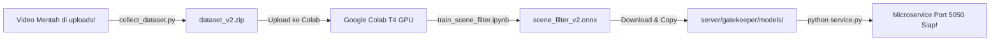

# 🎯 Panduan Training AI Gatekeeper (MobileNetV3-Small Scene Filter)
### Project: **ClipperVPS** (AI-Powered Video Pipeline)

Dokumen ini berisi panduan lengkap langkah demi langkah untuk melatih model AI lokal (**MobileNetV3-Small binary classifier**) yang bertugas memfilter frame video secara mandiri di CPU VPS sebelum dikirim ke Gemini Vision API.

---

## 🧠 Mengapa AI Gatekeeper Ini Dibuat?

Sesuai arsitektur dan diskusi optimalisasi:
1. **Zero API Cost di Awal**: 80–90% frame kotor (bumper sponsor, animasi 2D, slide teks, transisi hitam, wajah orang) disaring langsung di CPU VPS menggunakan model lokal (sub-10ms per frame).
2. **Hemat Token & Kuota Gemini**: Gemini Vision hanya dipanggil untuk frame yang sudah dipastikan **real product demonstration**, format **9:16 vertikal**, dan bebas gangguan.
3. **Hasil Video Akhir Maksimal**: ClipperVPS fokus pada video affiliate 30–35 detik (6–7 klip @ 5 detik) bertema *faceless hands-on demo* alat/perabotan/perlengkapan dapur.

---

## 🏗️ 3 Pilar Local Gatekeeper (Port 5050)

| Komponen | Model / Engine | Tugas & Kriteria Filter |
| :--- | :--- | :--- |
| **1. Face Gatekeeper** | MediaPipe BlazeFace | Menghapus frame jika terdapat wajah manusia (fokus *faceless hands-on*). |
| **2. Text Gatekeeper** | DBNet / PP-OCRv4 | Menghapus frame dengan area teks tebal >12% atau subtitle/watermark besar. |
| **3. Scene Gatekeeper** | **MobileNetV3-Small (`scene_filter_v2.onnx`)** | Membedakan frame **`valid_real` (0)** (demo produk nyata) vs **`rejected` (1)** (kartun, slide, bumper, transisi). |

---

## 🛠️ Alur Pelatihan (Training Workflow)



---

## 📋 Langkah 1: Kumpulkan & Siapkan Dataset

Jalankan script `collect_dataset.py` dari direktori `server/gatekeeper`:

```bash
cd server/gatekeeper
python collect_dataset.py --video-dir ../../public/uploads --max-per-video 30
```

*Atau arahkan ke folder yang berisi video-video produk Anda:*
```bash
python collect_dataset.py --video-dir /path/ke/video/mentah --max-per-video 40
```

### Apa yang dilakukan script ini?
1. Membaca video dari folder input.
2. Memotong frame secara otomatis ke rasio **9:16 vertikal** (sesuai spesifikasi affiliate video ClipperVPS).
3. Melakukan pra-labeling otomatis (heuristik Laplacian blur, deteksi saturasi, dan deteksi kartun sederhana).
4. Membagi data ke struktur:
   - `dataset/train/valid_real`
   - `dataset/train/rejected`
   - `dataset/val/valid_real`
   - `dataset/val/rejected`
5. Mengompres seluruh folder dataset menjadi satu file: **`dataset_v2.zip`**.

> 💡 **Tips Kurasi Manual (Opsional)**:
> Buka folder `dataset/train` sebentar. Jika ada gambar kartun/bumper yang salah masuk ke `valid_real`, Anda bisa memindahkannya ke folder `rejected` agar model AI semakin pintar.

---

## ☁️ Langkah 2: Training di Google Colab (Gratis GPU T4)

Anda **tidak memerlukan GPU mahal di komputer/VPS lokal**. Anda dapat menggunakan Google Colab yang sudah disediakan gratis:

1. Buka browser dan kunjungi: **[Google Colab](https://colab.research.google.com)**
2. Klik **Upload Notebook** dan pilih file:
   `server/gatekeeper/train_scene_filter.ipynb`
3. Pastikan runtime menggunakan GPU:
   - Menu: **Runtime** -> **Change runtime type** -> Pilih **T4 GPU** -> Simpan.
4. Jalankan Cell 1 untuk inisialisasi environment.
5. Pada Cell 2, upload file **`dataset_v2.zip`** yang sudah dibuat di Langkah 1.
6. Klik **Runtime** -> **Run all** (Jalankan semua cell).
   - Training hanya memakan waktu sekitar **2–4 menit**.
   - Model akan dievaluasi (akurasi, precision, recall).
   - Model otomatis diekspor ke format ONNX (`scene_filter_v2.onnx`).
   - Browser akan otomatis men-download file **`scene_filter_v2.onnx`**.

---

## 💻 Langkah 2 Alternatif: Training di Komputer Lokal (Jika Ada GPU / PyTorch)

Jika Anda memiliki Python & PyTorch di komputer lokal:
```bash
cd server/gatekeeper
python train_scene_filter.py --epochs 15 --batch-size 32 --lr 0.0001
```
Hasil file `scene_filter_v2.onnx` akan otomatis terbentuk di folder `models/scene_filter_v2.onnx`.

---

## 🚀 Langkah 3: Pasang Model ke ClipperVPS

1. Pindahkan file yang sudah di-download (`scene_filter_v2.onnx`) ke folder:
   ```
   clipperVPS/server/gatekeeper/models/scene_filter_v2.onnx
   ```
2. Jalankan script pengujian untuk memastikan model bekerja dengan baik:
   ```bash
   python test_gatekeeper.py
   ```
   Anda akan melihat log:
   ```
   [Gatekeeper] Scene Filter Model v2 loaded successfully!
   [Gatekeeper] Inference latency: ~7.2 ms per frame (CPU)
   ```

---

## 🔌 Langkah 4: Jalankan Microservice Gatekeeper

Jalankan service gatekeeper di port 5050:
```bash
cd server/gatekeeper
python service.py
```

Microservice ini akan:
- Memuat `scene_filter_v2.onnx`
- Memuat detektor wajah MediaPipe
- Memuat detektor teks DBNet
- Menerima request HTTP POST dari Node.js backend ClipperVPS (`/filter` dan `/filter-batch`).

Ketika ClipperVPS memproses video affiliate:
1. `videoFilterService.js` mengekstrak frame kandidat.
2. Setiap frame dikirim ke `http://127.0.0.1:5050/filter`.
3. Frame dengan wajah, teks tebal, atau diklasifikasikan sebagai `rejected` oleh `scene_filter_v2.onnx` langsung dibuang secara instan di CPU.
4. Hanya frame yang berstatus `keep: true` yang diteruskan ke Google Gemini Vision untuk analisis konten mendalam.

---

## ⚙️ Ringkasan File Baru / Diperbarui

- **`server/gatekeeper/service.py`**: Mendukung model custom binary classifier `scene_filter_v2.onnx` dengan fallback dinamis.
- **`server/gatekeeper/collect_dataset.py`**: Auto frame extraction, 9:16 vertical crop, heuristic pre-labeling, dan zip export.
- **`server/gatekeeper/train_scene_filter.py`**: Skrip PyTorch transfer learning MobileNetV3-Small & ONNX exporter opset 12.
- **`server/gatekeeper/train_scene_filter.ipynb`**: Notebook Google Colab 1-klik siap pakai.
- **`server/gatekeeper/PANDUAN_TRAINING_AI.md`**: Buku panduan lengkap pelatihan model AI.
