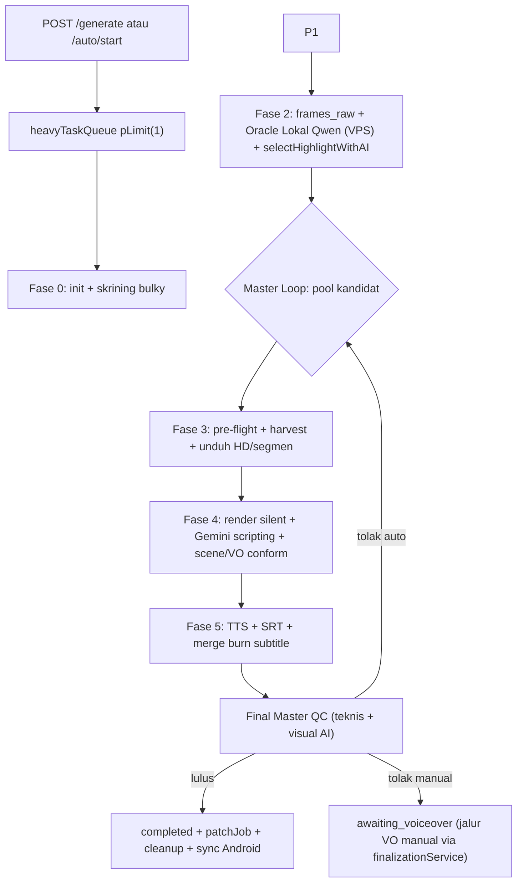

# 🗺️ Peta Alur Kerja Backend ClipperVPS — Evaluasi Langkah demi Langkah

> Sumber kebenaran: kode nyata per 2 Okt 2026. Semua nomor baris merujuk ke file yang disebutkan.
> Cara pakai: evaluasi satu per satu bagian `[ ]` di kolom **Status**, catat temuan di baris **📝 Catatan** bawah tiap fase.

---

## A. Titik Masuk (API Layer)

| Route | File | Yang dijalankan |
|---|---|---|
| `POST /api/generate` | `server/api/routes/generateRoutes.js:144` | Job manual → `runStage1Pipeline()` |
| `POST /api/auto/start` / `stop` / `status` | `server/api/routes/autoRoutes.js:165,212,143` | Loop auto → `runAutoStage1Worker()` (`server/worker/stage1Discovery.js:96`) |
| Endpoint voiceover / subtitle / conform | `server/api/routes/voiceoverRoutes.js` | `processJobVoiceover`, `retryJobSubtitles`, `conformExistingJobEditToAudio`, `runProfessionalFinalQcWithRepair` (semua di `server/worker/finalizationService.js`) |
| Riwayat job / progress | `server/api/routes/jobsRoutes.js` + `server/store/jobStore.js` | Baca `activeJobs` / `jobProgress` (Map in-memory + persist SQLite) |

**Gerbang konkurensi:** seluruh pipeline berat di-serial lewat `heavyTaskQueue` = `pLimit(1)` (`server/worker/queueManager.js`) — hanya 1 job AI/FFmpeg bersamaan (aman untuk CPU Termux).

- [ ] Evaluasi: apakah serialisasi `pLimit(1)` masih perlu, atau bisa 2 untuk PC?

---

## B. Pipeline Utama — `server/worker/stage1Render.js`

Fungsi inti: `_runStage1Pipeline` (L162–2919, **±2760 baris dalam 1 fungsi**). Wrapper exported di L2921.
Urutan fase di bawah diambil dari penanda `updateProgress({ step })` nyata di kode.

### Fase 0 — Inisialisasi & Skrining Produk
1. `step: 'start'` (L287) — persist job meta, resolve AI provider (Gemini/OpenRouter), `buildCreativeShotPlan()` + `buildProductFingerprint()` (`professionalPipelineService.js`).
2. `step: 'rejected_bulky'` (L229) — `isBulkyOrUnsuitableProduct()` (`discoveryService.js`) tolak produk oversized sejak dini.

- [ ] Evaluasi Fase 0
- 📝 Catatan:

### Fase 1 — Akuisisi Sumber & Gerbang (jalur evidence mode, L474–581)
3. `step: 'download'` (L336) — `downloadYouTubeVideo()` (`downloader.js`, spawn yt-dlp/ffmpeg).
4. `step: 'metadata_qc'` (L474) — `checkVideoMetadataCompliance()` (`videoFilterService.js`): aturan durasi/resolusi/aspect dari `config/videoLimits.js` + `config/nichePresets.js`.
5. `step: 'quick_preview'` (L510) — unduh segmen preview 10 detik murah.
7. `step: 'frame_probe'` (L535) — cek visual cepat 5 frame (`inspectFramesLocally`).
9. `step: 'product_verify'` (L581) — `verifyProductCandidateWithAI()` (Gemini vision: produk cocok dgn narasi). **Dilewati di mode manual** sesuai policy niche.

- [ ] Evaluasi Fase 1
- 📝 Catatan:

### Fase 2 — Analisa Cache & Pemilihan Highlight (L640–700)
10. `step: 'frames_raw'` (L646) — `extractFrames()` (`frameExtractor.js`): interval 3.0 detik, cap 200 frame (hemat Termux).
11. **Oracle Lokal Qwen (VPS)** (L655, stage event `gatekeeper`) — `vlmOracleService.js` via `worker.py` lokal (port 5000 + llama.cpp port 8080) untuk memvonis frame. **<3 frame bersih ⇒ throw `isAiRejection`**.
12. `selectHighlightWithAI()` (L679, `aiService.js`) — Gemini pilih jendela klip HANYA dari frame bersih; hasil `highlight.clips`.

- [ ] Evaluasi Fase 2
- 📝 Catatan:

### Fase 3 — Harvest Kandidat & Master Loop (L1086–1900)
13. `step: 'pre_flight'` (L1093, L1110) — `imageSearchService.js` cari gambar produk + `preSelectTop2CandidatesWithGemini()` ranking.
14. **Dynamic multi-video harvesting** (L1180+): jumlah sumber wajib per niche (kitchen=2, smartphone=1); multi-stream evidence mode dilewati di L1223; `step: 'auto_search_fallback'` (L797) temukan kandidat baru via `discoverYouTubeCandidatesForProduct()` / `searchMultiEngineVideos()`.
15. **Rescue storyboard** (L1438) — dirakit otomatis saat AI menolak konten tapi bukti visual ada.
16. `step: 'download_hd'` (L1839 manual / L1899 full) — unduh segmen saja hemat kuota (`RENDER_NO_FULL_DOWNLOAD`, `renderSections.js`) vs full 1080p. Kebijakan sebagian-cluster gagal di L1661. Sumber hilang JANGAN pernah di-remap ke Video #1 (L1765, L1779).

- [ ] Evaluasi Fase 3
- 📝 Catatan:

### Fase 4 — Rendering & Scripting (L1980–2500)
17. **HARD MOTION GATE** (L1983) — `auditRealMotionFromFrames()` tolak foto diam efek zoom/pan; `sampleDenseClustersAroundCleanFrames()` resampling rapat di sekitar frame bersih.
18. `step: 'render_silent'` (L2116) — `renderSilentAntiDetectionVideo()` (`videoRenderer.js`): potong 9:16, transformasi anti-deteksi (hflip/reframe), bumper.
19. `step: 'frames_trimmed'` (L2131) → `step: 'gpt_scripting'` (L2137) — sampling frame hasil cut final, lalu `generateAdAdvisorScriptWithAI()` hasilkan kotak scene + `rawVoiceScript` + caption + leksikon fonetik (`detectPhoneticLexiconWithAI`, `phoneticData.js`).
21. **Edit conform** (L2443–2445) — `conformClipsToVoiceover()` re-timing potongan visual ke durasi bicara nyata; lalu `renderSilentAntiDetectionVideo()` KEDUA kali (L2500).

- [ ] Evaluasi Fase 4
- 📝 Catatan:

### Fase 5 — Audio, Subtitle, Master Final
22. `step: 'tts_generating'` (L2408) — `generateVoiceoverTTS()` (`ttsService.js`, Gemini TTS saja + rantai model fallback) + `cleanScriptForTTS()`.
23. `generateSrtSubtitles()` (L2524, `subtitleService.js`) — pakai word boundaries bila tersedia.
24. `mergeVoiceoverAndBurnSubtitles()` (L2553, `videoRenderer.js`) — VO + subtitle terbakar + BGM (`BACKGROUND_MUSIC_VOLUME`) + SFX ⇒ MP4 final.
25. **Final QC** (L2565) — `runProfessionalFinalQcWithRepair()` (`finalizationService.js:208`): `runFinalMasterQc()` cek teknis + `verifyFinalRenderedFramesWithAI()` vonis visual. Gagal ⇒ file dihapus, throw `FINAL_MASTER_QC_FAILED` (auto: kembali ke Master Loop cari video lain; manual: turun ke `awaiting_voiceover`).
26. `step: 'completed'` (L2671) — `patchJob()` merge-persist (komentar L2665: kenapa MERGE bukan REPLACE — supaya niche/oemUrls/configSnapshot tidak hilang), bersih-bersih temp (`cleaner.js`), `syncVideoToAndroidStorage()` di Termux.

- [ ] Evaluasi Fase 5
- 📝 Catatan:

---

## C. Lapisan Error & Self-Healing (L2681–2918)

- `isAiRejection` → kandidat di-blacklist di `failedCandidateUrls`, Master Loop lanjut (`L2682–2691`, `L2730–2738`).
- Mode auto TIDAK BOLEH dilabel sukses tanpa video final (L2693–2722) — penyebab bug lama "job berhasil tapi output kosong".
- Mode manual gagal final → `awaiting_voiceover` dengan silent 9:16 preserved (L2750–2818, `L2836–2885`).
- `classifyPipelineError()` + `checkYouTubeHealth()` (`networkDiagnosticService.js`).
- Error kuota: `isQuotaErrorMessage` + `quotaService.js` (limit harian output).
- Observability: `recordStageEvent()` (`observabilityService.js`); hemat bandwidth: `trackSavedBandwidth()` (`bandwidthTracker.js`).
- Retry otomatis: `server/worker/autoRetryService.js` (`runAutoRetryWorker`).

- [ ] Evaluasi lapisan error
- 📝 Catatan:

---

## D. Titik Nyeri yang Terdeteksi (prioritas evaluasi)

1. **`_runStage1Pipeline` ±2760 baris satu fungsi** — fase 0–5 berbagi scope mutable (`highlight`, `candidateResults`, `visionState`, `silentOutputPath`). Risiko regresi tinggi tiap edit → perlu *characterization test* sebelum refactor pecah.
2. **Dua kali `renderSilentAntiDetectionVideo`** (L2117 & L2500) — potensi render ganda saat audio-driven OFF? Perlu diverifikasi apakah L2500 hanya jalan bila clips di-conform.
3. **Gatekeeper muncul di dua tempat** (jalur cache L655 dan jalur filter per-kandidat) — verifikasi keduanya memakai policy yang identik.
4. **Cabang flag manual-vs-auto** (`isAutoModeFallback`, `forceManualFallback`) banyak — kandidat penyederhanaan state machine.

---

## E. Diagram Alur

---

## F. Progress Evaluasi

| Fase | Status | Temuan | Keputusan |
|---|---|---|---|
| A. Entry + queue | ⬜ | | |
| 0. Init & skrining | ⬜ | | |
| 1. Sumber & gerbang | ⬜ | | |
| 2. Gatekeeper & highlight | ⬜ | | |
| 3. Harvest & Master Loop | ⬜ | | |
| 4. Render & scripting | ⬜ | | |
| 5. TTS/subtitle/QC final | ⬜ | | |
| C. Error & self-healing | ⬜ | | |
