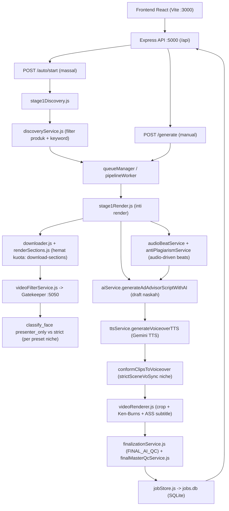
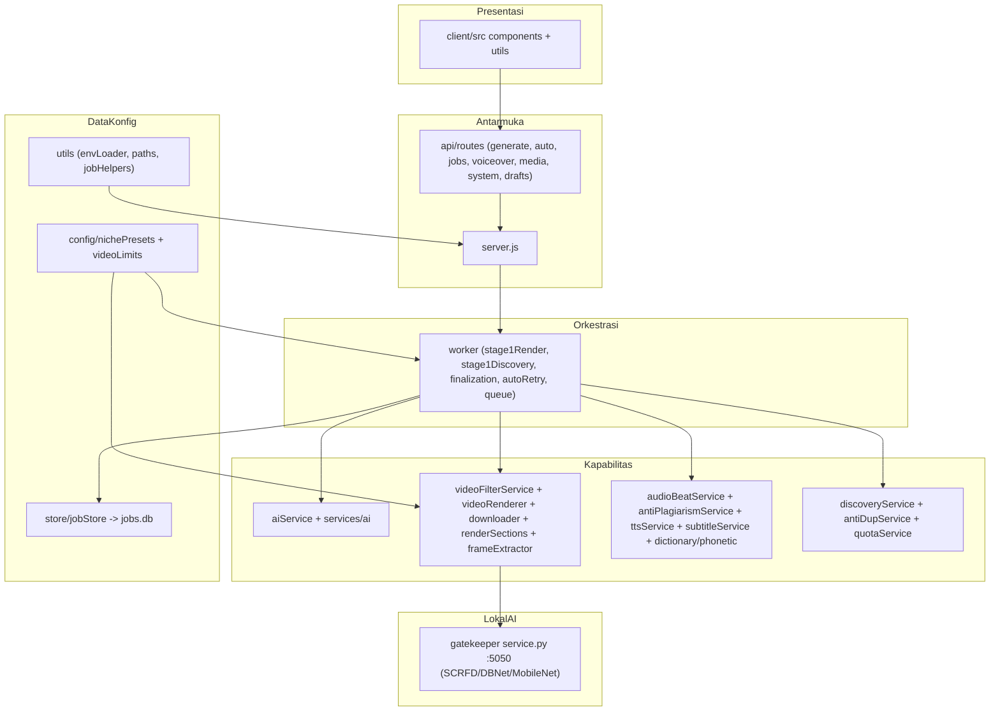
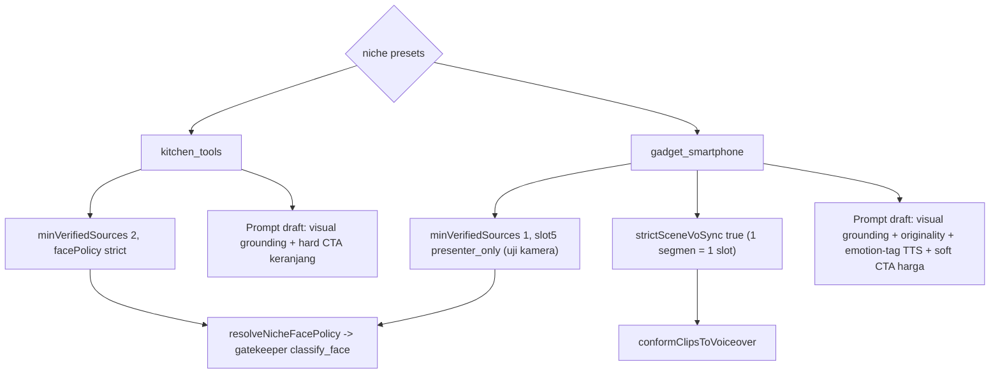

# RANGKUMAN CLIPPER — Inventaris Tools/Fungsi untuk Audit

> Dokumen inventaris seluruh modul ClipperVPS (backend, worker, services, gatekeeper, frontend, tooling) beserta diagram alur dan prioritas audit. Ukuran file menandai area berisiko/berdampak tinggi.
>
> **§11** = verifikasi temuan audit eksternal terhadap kode nyata (termasuk 1 kondisi **rusak sekarang**: urutan middleware auth). **§12** = todo plan perbaikan berprioritas (P0→P6) dengan gerbang verifikasi; belum dieksekusi.

---

## 1. Backend API — `server/server.js` + `server/api/routes/`

Server Express (port 5000). Semua route di-mount di bawah `/api`.

| Route file | Endpoint | Fungsi |
|---|---|---|
| **generateRoutes.js** | `POST /generate` | Picu pipeline render 1 job (gerbang utama pembuatan klip). |
| **autoRoutes.js** | `POST /auto/start`, `/auto/stop`, `GET /auto/status`, `/auto/progress/:runId`, `GET/POST /auto/keywords/stats`, `/auto/keywords/reset` | Mode AUTO: discovery → render massal, statistik & reset kata-kunci terpakai. |
| **jobsRoutes.js** | `GET /jobs`, `DELETE /jobs/:jobId`, `POST /jobs/:jobId/retry`, `POST /jobs/:jobId/auto-retry/start|stop`, `GET /jobs/:jobId/auto-retry/status`, `GET /progress/:jobId` | CRUD riwayat job, retry manual, auto-retry, polling progres. |
| **voiceoverRoutes.js** | `POST /upload-voiceover`, `/regenerate-voiceover`, `/retry-subtitles`, `/retry-job-tts`, `/batch-tts/start|stop`, `GET /batch-tts/status` | Voiceover manual, regenerasi TTS, retry subtitle, TTS batch. |
| **mediaRoutes.js** | `GET /audio/:f`, `/video/:f`, `/download/:f`, `/jobs/:jobId/script.txt` | Serving aset hasil + unduh + teks naskah. |
| **systemRoutes.js** | `GET /health`, `/network-diagnostic`, `/daily-limit`, `/niches`, `/cookies-status`, `/english-dictionary` (GET/POST), `/bandwidth-stats`, `/rejected-frames`, `/open-folder` (GET/POST), `POST /find-products`, `/find-videos`, `/upload-cookies`, `/restart` | Diagnostik sistem, batas kuota harian, daftar niche, manajemen cookie/kamus, buka folder, restart PM2, helper ProductFinder. |
| **draftsRoutes.js** | `GET/POST /`, `DELETE /:id` | Antrean "draft" offline (bukan naskah review). |

Statik: `app.use('/api/rejected-frames/yunet', ...)` — jejak frame yang ditolak gatekeeper.

---

## 2. Worker / Orkestrasi Pipeline — `server/worker/`

- **`stage1Render.js`** (126 KB — terbesar, risiko tinggi): inti render — harvest kandidat, unduh (full/section), gatekeeper, naskah, TTS, conform klip, render, QC. Memuat logika hemat-kuota (`RENDER_DOWNLOAD_SECTIONS` / `RENDER_NO_FULL_DOWNLOAD`), audit anti-photo-still (offset-aware), dan alur audio-driven.
- **`stage1Discovery.js`** (22 KB): discovery produk/kandidat (Shopee/YouTube), filter durasi minimum.
- **`finalizationService.js`** (27 KB): penyelesaian job, pemetaan niche → `strictSceneVoSync`, QC akhir (`FINAL_AI_QC`, `FINAL_AI_QC_STRICT`).
- **`autoRetryService.js`** (16 KB): mesin auto-retry job gagal.
- **`pipelineWorker.js`** & **`queueManager.js`** (kecil): entry / pengatur antrean job.

---

## 3. Services — `server/services/`

### AI / LLM
- `aiService.js` (176 KB): `analyzeYouTubeVideoWithGemini`, `analyzeMultipleYouTubeVideosWithGemini`, `analyzeVideoWithGeminiFileApi`, `selectHighlightWithAI`, `verifyProductCandidateWithAI`, `verifyFinalRenderedFramesWithAI`, `generateAdAdvisorScriptWithAI` (draft naskah — cabang gadget vs kitchen), `detectPhoneticLexiconWithAI`, `repairJson`.
- `services/ai/`: `aiClient.js` (konfigurasi klien / fallback model), `aiValidators.js` (validasi schema output), `promptBuilders.js` (39 KB, perakit prompt).
- `professionalPipelineService.js` (15 KB): orkestrator alur "story-first".

### Audio-Driven & Anti-plagiarisme
- `audioBeatService.js` (14 KB): `isAudioDrivenEnabled`, `resolveWhisperConfig`, `extractSourceAudio`, `transcribeAudio` (whisper.cpp), `parseWhisperJson`, `assessVoiceoverPresence`, `buildBeatsFromSegments`, `analyzeSourceAudioForBeats`.
- `antiPlagiarismService.js` (7 KB): `countWords`, `wordCountDrift`, `paraphraseBeats`, `beatsToScript`.
  - ✅ Komentar header sudah diperbaiki (P3.3): kini menyatakan SUDAH wired di `stage1Render.js` (gerbang `AUDIO_DRIVEN_SCENES`), bukan lagi "Belum disambungkan".

### TTS & Subtitle
- `ttsService.js` (24 KB): `runFfmpegAsync`, `applyIndonesianPhoneticFixes`, `cleanScriptForSubtitles`, `prepareScriptForTTS`, `prepareScriptForGeminiTTS`, `parseScriptToScenes`, `generateVoiceoverGeminiTTS`, `generateVoiceoverTTS` (Gemini = satu-satunya engine).
- `subtitleService.js` (22 KB): `generateAssSubtitles`, `generateAssSubtitlesFromWordBoundaries`, `parseAssTimeToSeconds`, `scaleAssSubtitles`.
- `dictionaryService.js` (7 KB) + `phoneticData.js` (11 KB): kamus pelafalan / taling (lihat `TALING_DICTIONARY.md`).

### Video / Render / Frame
- `videoRenderer.js` (28 KB): `renderSilentAntiDetectionVideo` (crop Ken-Burns; `-ss = startSeconds - sourceOffsetSec` untuk klip segmen).
- `downloader.js` (35 KB): `downloadYouTubeVideo` (yt-dlp; dukung `--download-sections`, cookie, proxy, cap tinggi `RENDER_MAX_HEIGHT`, `RENDER_VIDEO_ONLY`).
- `renderSections.js` (2.8 KB): `planSectionDownloads` (klaster segmen hemat kuota, pure function).
- `frameExtractor.js` (5.6 KB): ekstraksi frame FFmpeg hemat.
- `videoFilterService.js` (83 KB — risiko tinggi): `findCookiesFile`, `resolveNicheFacePolicy`, `callAIGatekeeperMicroservice`, `inspectFramesLocally`, `filterCandidateFramesPerFrame` (pool `cameraResultEligible`), filter intro / bumper / subtitle.

### Discovery / Dedup / Kapasitas
- `discoveryService.js` (190 KB — TERBESAR): filter produk (`isFoodOrBeverageProduct`, `isBundleOrSetProduct`, `isHighVariationOrHardToMatchProduct`, `isBulkyOrUnsuitableProduct`), manajemen keyword (`getAutoKeywords`, `generateCombinatorialKitchenKeywords`, `loadUsedKeywords` / `saveUsedKeywords` / `markKeywordAsUsed` / `isKeywordUsed` / `isProductTitleUsed` / `clearUsedKeywords`), `discoverSingleShopeeProduct`, `normalizeKeyword`.
- `antiDupService.js` (2.5 KB): anti-duplikat klip / produk.
- `quotaService.js` (3.1 KB): batas harian kuota Gemini (10 RPD TTS).
- `finalMasterQcService.js` (6.3 KB): QC master akhir.

### Infra / Utilitas
- `bandwidthTracker.js` (5.7 KB): statistik pemakaian data (`bandwidth_stats.json`).
- `networkDiagnosticService.js` (10 KB): uji konektivitas / kecepatan.
- `cleaner.js` (1.9 KB): bersihkan temp.
- `binaryChecker.js` (3.6 KB): cek ketersediaan FFmpeg / yt-dlp.

---

## 4. Gatekeeper AI Lokal — `server/gatekeeper/service.py` (91 KB) + tooling

Service HTTP port 5050. Pipeline visi CPU real-time: SCRFD / YuNet / MediaPipe BlazeFace (wajah), DBNet PP-OCRv4 ONNX (subtitle terbakar & promo overlay), MobileNetV3 (klasifikasi adegan natural vs kartun / bumper).

- Fungsi kunci untuk audit: `classify_face` (presenter vs content: area ≥ 6% di paruh atas `cy < 0.55h` **ATAU** persisten `temporal_hits >= 2` = min_hits=1 produksi), `detect_faces`, `detect`, `apply_temporal_presenter_track`, `_is_valid_human_face`.
- Config / flags: `GK_FACE_BACKEND` (scrfd default), `GK_SCRFD_INPUT`, `GK_TEXT_CHECK_STRIDE`, `GK_MAX_BATCH_FRAMES`, `GK_WATERMARK_PROBE`, `SAMPLE_MAX_FRAMES`, `SAMPLE_BATCH_MODE`.
- Tooling latihan / dataset: `collect_dataset.py`, `collect_smartphone_frames.py`, `merge_new_dataset.py`, `curate_dataset.py`, `add_diverse_faces.py`, `add_watermark_frames.py`, `make_datasheet_84d.py`, `download_models.py`, `train_scene_filter.py` (+ notebook).
- Test: `test_gatekeeper.py`, `test_face_policy.py`, `test_scrfd.py`, `test_phase1_efficiency.py`.

---

## 5. Config & Store

- `server/config/nichePresets.js` (30 KB): preset `kitchen_tools` & `gadget_smartphone` (slot, `facePolicy`, `strictSceneVoSync`, `minVerifiedSources`, curated hooks / CTA / keywords, `getSlotFacePolicy`, `generateCombinatorialGadgetKeywords`, `getNichePreset` + alias).
- `server/config/videoLimits.js`: `MIN` / `MAX_VIDEO_DURATION_SEC` (300 / 900).
- `server/store/jobStore.js` (8 KB): persist job ke SQLite (`jobs.db`, mode WAL).
- Util: `utils/envLoader.js`, `utils/jobHelpers.js`, `utils/paths.js`.

---

## 6. Frontend — `client/src/`

Komponen React (Vite port 3000): `App.jsx`, `Navbar`, `InputCard`, `AutoModePanel`, `ProductFinder`, `JobHistoryPanel` (42 KB — riwayat + hapus / retry / TTS), `ProgressCard`, `CaptionCard`, `VideoPlayer`, `VoiceoverUploader`, `SettingsModal`, `BandwidthModal`, `AuthTokenModal`, `DependenciesStatus`, `ErrorBoundary`.

Util: `utils/auth.js` (token akses), `utils/clipboard.js`.

---

## 7. Tooling Root (deployment / diagnostik)

- Jalankan: `dev-runner.js` (Express + Vite), `JALANKAN_VPS.cmd` (auto `git pull` + run + menu SSH), `LIHAT_LOG_LIVE.cmd`, `tunnel.sh` (Cloudflare), `menu-vps.sh`.
- Setup / sync: `setup-termux.sh`, `setup-gatekeeper.sh`, `setup-codespace.sh`, `update.sh`, `SYNC_DATASET_KE_VPS.cmd`.
- Perawatan: `clean-failed-jobs.js`.
- Diagnostik ad-hoc: `server/rxbench_pc.mjs`, `rxcookietest.mjs`, `inspect_runs.mjs`, `extract_prompts2.mjs`, `migrate-jobs-to-sqlite.mjs`, `test_speed.js`.
- Folder `scratch/`: test integrasi ad-hoc (multi-niche, quad collage, kitchen optimization, dsb).

---

## Diagram 1 — Alur Pipeline (AUTO & MANUAL)

## Diagram 2 — Lapisan Modul & Ketergantungan

## Diagram 3 — Percabangan Niche (kitchen vs smartphone)

---

## 8. Alur Kerja Aplikasi End-to-End (Step-by-Step)

### 8a. Mode MANUAL (user menyiapkan link)
1. **Frontend** (`InputCard`/`JobHistoryPanel`) kirim `POST /generate` berisi `youtubeUrl` (+ opsional `oemUrls`, `shopeeLink`, `productTitle`, `niche`).
2. **`generateRoutes.js`**: validasi URL (`isValidHttpUrl` + `extractVideoId`), tolak produk besar (`isBulkyOrUnsuitableProduct`), selesaikan `niche` (alias → `getNichePreset`). **PENTING**: jika `options.sourcePolicy` kosong → dipaksa **`explicit_only`** (baris 216–219). Cek kuota harian (`getDailyOutputVideoStats`).
3. **`runStage1Pipeline` → `stage1Render.js`**:
   - `preferMultiVideo = singleVideoOnly ? false : true`; `explicitOnly = sourcePolicy==='explicit_only'`.
   - **Fast-path** (694): evaluasi URL utama via `evaluateCandidate`; lolos bila ≥3 klip & ≥15 dtk.
   - **Harvest** (730): dengan `explicit_only`, `allowAutoSearch=false` dan loop `while(... && !explicitOnly)` (805, 972) **dilewati** → hanya `youtubeUrl` + `oemUrls` user yang masuk `candidatePool`. **TIDAK ADA PENCARIAN WEB.**
4. **Unduh** tiap kandidat: `downloader.downloadYouTubeVideo` — hemat kuota via `renderSections.planSectionDownloads` + `--download-sections` saat `RENDER_DOWNLOAD_SECTIONS=1`; `RENDER_NO_FULL_DOWNLOAD=1` = tegas (tanpa unduh penuh).
5. **Gatekeeper frame**: `videoFilterService.inspectFramesLocally`/`filterCandidateFramesPerFrame` → `callAIGatekeeperMicroservice` (:5050). Face policy dari `resolveNicheFacePolicy(niche)`.
6. **Draft naskah**: `aiService.generateAdAdvisorScriptWithAI` (cabang gadget/kitchen).
7. **Audio-driven** (opsional, `AUDIO_DRIVEN_SCENES`): `audioBeatService.analyzeSourceAudioForBeats` → `antiPlagiarismService.paraphraseBeats` → `beatsToScript` → `finalVoiceScript`.
8. **TTS**: `ttsService.generateVoiceoverTTS` (Gemini) — fonetik via `dictionaryService`/`phoneticData`.
9. **Conform klip**: `professionalPipelineService.conformClipsToVoiceover` (niche `strictSceneVoSync`).
10. **Render**: `videoRenderer.renderSilentAntiDetectionVideo` (crop/Ken-Burns) → `mergeVoiceoverAndBurnSubtitles` (+ `subtitleService.generateAssSubtitles`).
11. **QC akhir**: `finalizationService` + `finalMasterQcService.runFinalMasterQc` (`FINAL_AI_QC`).
12. **Simpan**: `jobStore.persistJob` → `jobs.db`; hasil ke `outputDir`; `syncVideoToAndroidStorage` (Termux).

### 8b. Mode AUTO (discovery otomatis)
`POST /auto/start` → `runAutoStage1Worker`: `getAutoKeywords` (niche) → `discoverSingleShopeeProduct`/`discoverShopeeProducts` (produk) → `discoverYouTubeCandidatesForProduct`/`searchMultiEngineVideos` (cari video) → per kandidat jalankan langkah 4–12 di atas. Dedup: `antiDupService` + `used_keywords.json`. **Ini satu-satunya alur yang boleh mencari di mesin telusur.**

---

## 9. Jaminan & Aturan Kunci (verifikasi kode)

| Aturan | Status | Bukti kode |
|---|---|---|
| **Manual (semua niche, spt. smartphone) TIDAK mencari video di mesin telusur saat link disiapkan** | ✅ Terjamin | `generateRoutes.js:216-219` default `explicit_only`; `stage1Render.js:731` `allowAutoSearch=false`; loop cari (`805`,`972`) guarded `&& !explicitOnly`. Teks progres menyesatkan kini diperbaiki (`stage1Render.js:737-748`). |
| Manual OEM tetap lolos gerbang visual tapi **tidak** verifikasi produk Gemini | ✅ | `stage1Render.js:771-799` (`skipGeminiProductMatch:true`). |
| Unduh hemat kuota (auto & manual, hanya segmen klip) | ✅ | `RENDER_DOWNLOAD_SECTIONS`/`RENDER_NO_FULL_DOWNLOAD` + `renderSections.planSectionDownloads`. |
| Filter wajah uji kamera smartphone = `presenter_only` (hanya blokir presenter; wajah konten lolos) | ✅ | `service.py classify_face` (`≥6% & upper-half` ATAU `temporal_hits≥2`) + `resolveNicheFacePolicy` + preset slot 5. |
| Draft & TTS smartphone disetarakan ke alur kitchen | ✅ | `aiService.js` cabang gadget: visual grounding, originality, emotion-tag, leksikon fonetik. |
| Batas durasi video MIN/MAX (300/900 dtk) | ✅ | `config/videoLimits.js`. |

---

## 10. Checklist Fungsi per Modul (untuk audit satu-satu)

> ✅ = sudah ada test/verifikasi; ⬜ = belum diuji eksplisit. Prioritaskan ⬜ pada jalur panas.

### `aiService.js`
- `analyzeYouTubeVideoWithGemini` ⬜ — analisis 1 video (hook/scene/kandidat).
- `analyzeMultipleYouTubeVideosWithGemini` ⬜ — analisis multi-video (harvest auto).
- `analyzeVideoWithGeminiFileApi` ⬜ — analisis video besar via File API Gemini.
- `selectHighlightWithAI` ⬜ — pilih klip highlight (`startSeconds`/`duration`).
- `verifyProductCandidateWithAI` ⬜ — gerbang kecocokan produk vs frame.
- `verifyFinalRenderedFramesWithAI` ⬜ — QC frame render akhir.
- `generateAdAdvisorScriptWithAI` ⬜ — **draft naskah** (cabang gadget/kitchen; scene/caption/lexicon).
- `detectPhoneticLexiconWithAI` ⬜ — deteksi istilah Inggris→fonetik.
- `repairJson` ✅ — perbaikan JSON LLM.
- util internal: `getAiClientConfig`, `formatEnrichedCaption`, `getDynamicProductHookFallback`, `truncateProductDescription`, `formatApiError`, `isQuotaError`.

### `discoveryService.js` (190 KB)
- Filter produk: `isFoodOrBeverageProduct`, `isBundleOrSetProduct`, `isHighVariationOrHardToMatchProduct`, `isBulkyOrUnsuitableProduct` ⬜.
- Keyword: `normalizeKeyword`, `getAutoKeywords`, `generateCombinatorialKitchenKeywords`, `DEFAULT_AUTO_KEYWORDS` ⬜.
- Siklus pakai: `loadUsedKeywords`, `saveUsedKeywords`, `markKeywordAsUsed`, `isKeywordUsed`, `isProductTitleUsed`, `getUsedKeywordsStats`, `clearUsedKeywords` ✅.
- Discovery: `discoverSingleShopeeProduct`, `discoverShopeeProducts`, `discoverBrandedShopeeProduct`, `discoverYouTubeCandidatesForProduct` ⬜.
- Pencarian: `searchMultiEngineVideos`, `searchBingVideos`, `searchDuckDuckGoVideos`, `searchVideosByProductImage` ⬜.
- Shopee util: `fetchShopeePageMeta`, `isShopeeProductUrl`, `findMatchingShopeeProductUrl`, `buildShopeeSearchUrl`, `extractShopeeLinkFromText` ⬜.
- Teks: `extractCoreProductInfo`, `cleanTitle`, `normalizeText` ⬜.

### `downloader.js`
- `downloadYouTubeVideo` ⬜ — yt-dlp (kualitas, cookie, `section` hemat kuota).
- `searchYouTubeVideos` ⬜, `buildCleanYouTubeQuery` ⬜, `extractVideoId` ✅, `getSmartProxyArgs` ⬜, `isLocalPortListening` ⬜.

### `videoFilterService.js` (83 KB)
- `findCookiesFile` ⬜, `fetchVideoMetadataAndStream` ⬜, `checkVideoMetadataCompliance` ⬜.
- `gatekeeperFrameBudget` ⬜, `sampleFramesFromStream` ⬜, `sampleDenseClustersAroundCleanFrames` ⬜.
- `callAIGatekeeperMicroservice` ⬜, `callWatermarkProbe` ⬜.
- `resolveNicheFacePolicy` ✅, `inspectFramesLocally` ✅, `filterCandidateFramesPerFrame` ✅, `poolMultiCandidateFrames` ⬜.

### `videoRenderer.js`
- `renderSilentAntiDetectionVideo` ⬜ — crop/Ken-Burns, `-ss = startSeconds - sourceOffsetSec`.
- `mergeVoiceoverAndBurnSubtitles` ⬜, `appendBumperVideo` ⬜, `normalizeRenderClips` ⬜, `getMediaDurationSec` ⬜, `getVideoDimensions` ⬜.

### `renderSections.js` / `frameExtractor.js` / `subtitleService.js`
- `planSectionDownloads` ✅ — klaster segmen (pure).
- `extractFrames` ⬜ — ekstraksi frame FFmpeg.
- `generateAssSubtitles` ⬜, `generateAssSubtitlesFromWordBoundaries` ⬜, `scaleAssSubtitles` ✅, `parseAssTimeToSeconds` ✅.

### `ttsService.js`
- `generateVoiceoverTTS` ⬜, `generateVoiceoverGeminiTTS` ⬜ — engine TTS tunggal.
- `prepareScriptForTTS`/`prepareScriptForGeminiTTS`/`cleanScriptForSubtitles` ⬜, `parseScriptToScenes` ⬜, `applyIndonesianPhoneticFixes` ⬜, `runFfmpegAsync` ⬜.

### `audioBeatService.js` / `antiPlagiarismService.js`
- `isAudioDrivenEnabled` ✅, `resolveWhisperConfig` ✅, `extractSourceAudio` ⬜, `transcribeAudio` ⬜, `parseWhisperJson` ✅, `assessVoiceoverPresence` ⬜, `buildBeatsFromSegments` ⬜, `analyzeSourceAudioForBeats` ⬜.
- `countWords` ✅, `wordCountDrift` ✅, `paraphraseBeats` ⬜, `beatsToScript` ✅. ✅ komentar header sudah diperbaiki (P3.3 — tidak lagi bilang "belum disambungkan").

### `professionalPipelineService.js` / `finalMasterQcService.js` / `finalizationService.js`
- `buildProductFingerprint`, `buildCreativeShotPlan`, `describeCreativePlan`, `conformClipsToVoiceover`, `choosePreferredCandidateSet` ⬜.
- `runFinalMasterQc` ⬜. `finalizationService` (niche→strictSceneVoSync, QC akhir) ⬜.

### `dictionaryService.js` / `phoneticData.js`
- `loadEnglishDictionary` ✅, `saveToEnglishDictionary` ⬜, `applyEnglishLexicon` ⬜, `restoreStandardText` ⬜.
- `getTalingDictionary` ⬜, `fixIndonesianWordPhonetics` ⬜, `applyTalingPhonetics` ⬜.

### Infra: `quotaService` / `antiDupService` / `bandwidthTracker` / `networkDiagnosticService` / `binaryChecker` / `cleaner`
- `getDailyOutputVideoLimit`/`getDailyOutputVideoStats` ⬜.
- `getAllUsedYouTubeVideoIds`/`getAllUsedBrandProductPairsToday`/`getAllUsedProductNounsToday` ⬜.
- `trackBandwidth`/`trackSavedBandwidth`/`getBandwidthStats`/`resetBandwidthStats`/`formatBytes`/`bytesToMB` ⬜.
- `getPublicIpAddress`/`classifyPipelineError`/`checkYouTubeHealth` ⬜.
- `getFFmpegPath`/`getYtDlpPath`/`checkSystemDependencies` ⬜.
- `cleanupTempFiles`/`deleteJobTempDirectory`/`deleteJobFiles` ⬜.

### Worker (`stage1Render`, `stage1Discovery`, `autoRetryService`, `pipelineWorker`)
- `stage1Render`: `runStage1Pipeline`, `evaluateCandidate`, harvest & render ⬜ (file terbesar — audit tiap cabang niche/manual/auto).
- `stage1Discovery`: `runAutoStage1Worker` ⬜.
- `autoRetryService`: `runAutoRetryWorker`, `conformExistingJobEditToAudio`, `runProfessionalFinalQcWithRepair`, `syncVideoToAndroidStorage`, `processJobVoiceover` ⬜.

### `store/jobStore.js` & `config/nichePresets.js`
- jobStore: `activeJobs`, `jobProgress`, `updateJobProgress`, `persistJob`, `deletePersistedJob`, `loadJobsFromDisk`, `atomicWriteJsonSync`, `sanitizeJobForDisk`, `publicAutoRetryState`, `publicAutoRunState`, `updateAutoRun`, `getLatestAutoRun`, `jobsFilePath` ⬜ (hati-hati reentrancy SQLite).
- nichePresets: `getAllNiches`, `getNichePreset` (+alias), `getSlotFacePolicy`, `generateCombinatorialGadgetKeywords` ⬜.

### Gatekeeper `service.py`
- `classify_face` ✅, `detect_faces` ⬜, `detect` ⬜, `apply_temporal_presenter_track` ✅, `_is_valid_human_face` ⬜; DBNet/OCR & MobileNet scene filter ⬜; `process_single_frame` ⬜.

---

## 11. Verifikasi Temuan Audit Eksternal (dibandingkan kode nyata)

Legenda: ✅ terverifikasi benar · ⚠️ sebagian/salah kalibrasi · ❌ kondisi lebih buruk dari yang dilaporkan · ➕ temuan tambahan.

| # | Temuan audit | Status | Bukti di kode |
|---|---|---|---|
| 1 | Middleware token terpasang **setelah** router `/api` → semua endpoint lolos dari auth | ❌ **rusak sekarang** (bukti stack penuh) | Urutan registrasi sebenarnya di `server.js`: `cors()` 162 → `express.json` 163 → `urlencoded` 164 → **router `/api` 182–188** → **`app.use(tokenAuthMiddleware)` 247** → static `rejected-frames` 456 → error handler 472 → `app.listen` 485. Tidak ada middleware auth lain sebelumnya, dan grep di `server/api/routes/*.js` atas `API_ACCESS_TOKEN` / `x-api-token` / `timingSafeEqual` / `401` = **0 kecocokan** (jadi tidak ada_router punya penjaga sendiri_). Express menjalankan stack sesuai urutan → path yang sudah ditangani router tidak pernah sampai ke middleware, **bahkan saat `API_ACCESS_TOKEN` di-set**. Log baris 167–172 ("sensitive endpoints are protected") menyesatkan. |
| 2 | Endpoint operasi sistem & cookie tanpa jejak audit | ✅ | `systemRoutes.js`: `POST /restart` (menjalankan `update.sh`/`pm2`, baris ~374), `POST /open-folder` (~325) & `GET /open-folder` (~363) memanggil `explorer/xdg-open`, `POST /upload-cookies` (~511) menulis `server/cookies.txt`. Tidak ada audit log maupun rate limit diketiganya. |
| 3 | `/health` membocorkan konfigurasi | ➕ | `systemRoutes.js` 146–204 mengembalikan `activeAiEngine`, `geminiModel`, `openRouterKeyConfigured`, `geminiKeyConfigured`, versi ffmpeg/yt-dlp. Nilai key tidak bocor, tapi fingerprint konfigurasi layak disembunyikan dari akses publik. |
| 4 | Monitor belum terstruktur | ✅ | Yang ada hanya `updateJobProgress` (string pesan) + `bandwidthService`; tidak ada event per stage (durasi, provider, byte, jumlah kandidat diterima/ditolak, alasan gagal). |
| 5 | Coverage uji rendah | ✅ | Sensus di §10: mayoritas fungsi inti `⬜`. |
| 6 | Ambang wajah tersebar/hardcode | ✅ DIPERBAIKI (P3.1) | DULU: `gatekeeper/service.py:classify_face` men-hardcode `0.06` & `0.55`; Node hanya kirim `facePolicy` + `min_hits`; `test_face_policy.py` default `min_hits=2` vs production `1`. KINI: satu sumber `GATEKEEPER_CONFIG.PRESENTER_*` (Node) dikirim via payload → `service.py` konstanta modul `PRESENTER_*` (fallback sama, override `GK_PRESENTER_*`) di-thread ke `classify_face`/`detect_faces`/`process_batch`; default temporal diselaraskan ke `min_hits=1`. |
| 7 | Terlalu banyak flag | ✅ DIPERBAIKI (P5) | ~25 flag `GK_*`/`RENDER_*`/`AUDIO_DRIVEN_*`/`FINAL_AI_QC*` dibaca langsung dari `process.env` saat eksekusi, tidak dibekukan per job → job lama tidak bisa direproduksi. **Diperbaiki P5:** `config/runtimeFlags.js` membekukan nilai efektif flag inti ke `job.configSnapshot` saat create (satu sumber `FLAG_NORMALIZERS`), dan retry menerapkannya kembali + log. |
| 8 | Balap pada state job | ✅ DIPERBAIKI (P4/P5) | Bukan antar-proses (satu Node + satu instans PM2). Risiko nyata: mutasi objek di route (`job.youtubeUrl = ...`) dan `updateJobProgress` → `persistJob` tiap tick. **Diperbaiki P4:** `patchJob` atomik (baca-gabung-tulis satu transaksi) menggantikan pola `activeJobs.set`+`persistJob`, guard transisi stage, throttle persist 1×/s di `updateJobProgress`, retry route dimigrasi; dikunci `jobStorePatch.test.js`. **Diperbaiki P5:** `job.configSnapshot` membekukan flag saat create agar retry tak terpengaruh perubahan `.env`. State machine penuh tetap tidak diperlukan. |
| 9 | AI-heavy (durasi/overlap/format jangan ke AI) | ⚠️ sebagian salah | Sudah deterministik: `ai/aiValidators.js` (`normalizeClipPlan`, `buildFallbackHighlightPlan`, `validateAiHighlightsResponse`), `videoRenderer` memaksa `clip plan == AI plan` + FFprobe mengoreksi durasi, `audioBeatService.conformClipsToVoiceover` menyetel durasi klip. Yang memang masih AI: product verification (`verifyProductInShopeeImages`), dedupe draft, kualitas naskah. |
| 10 | Drift komentar vs wiring | ✅ | `antiPlagiarismService.js` header: "Belum disambungkan ke worker live" padahal `stage1Render.js` memanggil `paraphraseBeats`. |
| 11 | Ukuran monolith | ✅ (number riil) | `discoveryService.js` **4691** baris, `aiService.js` **3138**, `stage1Render.js` **2640**, `gatekeeper/service.py` ~1800, `videoFilterService.js` ~2000. |
| 12 | TTS satu engine | dikecualikan | Sesuai instruksi (akan diganti API lain). Catatan struktural: pemanggil ada **dua** (`stage1Render.js` ±2228, `finalizationService.js` ±465) → jaga **satu** interface `generateVoiceoverTTS(...)` agar penggantian tidak menyebar. |

---

## 12. Todo Plan Perbaikan (disetujui dulu, baru dieksekusi)

Prinsip urutan: **aman → terlihat → terbukti → rapi**. Refactor besar terakhir, setelah ada jaring pengaman.

### 🔴 P0 — Tutup pintu API ✅ SELESAI & TERUJI (lihat bukti di bawah tiap item)
- [x] P0.1 Pindahkan `app.use(tokenAuthMiddleware)` ke **sebelum** blok mount router (`server.js` ±181), pertahankan allowlist endpoint publik (`/api/health` sebagian, `/api/daily-limit`, `/api/niches`, `/api/video|audio|download`, `/api/rejected-frames`).
  → Middleware pindah ke file baru `server/api/middleware/tokenAuth.js` dan dipasang di `server.js` **sebelum** semua router; urutan dikunci oleh tes statis `tests/tokenAuth.test.js`.
- [x] P0.2 `cors()` → origin allowlist: `localhost`/`127.0.0.1` + `CLOUDFLARE_TUNNEL_URL`/`PUBLIC_BASE_URL` dari `.env`.
  → `buildCorsOptions()`/`isAllowedOrigin()`: izinkan localhost + LAN privat (10/8, 172.16/12, 192.168/16) + origin eksplisit dari env + `CORS_EXTRA_ORIGINS`; request tanpa Origin (curl/skrip) tetap bebas. Saat token kosong CORS sengaja masih longgar supaya tidak memutus alur lama; origin asing yang ditolak dicetak sekali.
- [x] P0.3 Tolak boot dengan cara aneh: jika `API_ACCESS_TOKEN` kosong **dan** tunnel aktif → cetak peringatan keras di konsol (satu kali), jangan diam-diam membuka.
  → `describeAuthPosture()` dipakai di `app.listen()` (sesudah `reloadEnvironment()`), mencetak ⚠️⚠️ saat tunnel aktif tanpa token, dan pesan lama yang menyesatkan ("Sensitive endpoints are protected") dihapus.
- [x] P0.4 Audit log append-only (`server/logs/audit.log`, via `pathManager`): siapa/kapan/apa untuk `POST /restart`, `/open-folder`, `/upload-cookies`, `/english-dictionary` (POST), `/find-products`, `/find-videos`.
  → `server/utils/security.js:recordAuditEvent()` + `logsDir` baru di `utils/paths.js`; rotasi otomatis >2 MB; **jumlah byte saja** yang dicatat untuk cookies (isi cookie tidak pernah masuk log); percobaan token salah/hilang juga dicatat sebagai `auth-rejected`. `logs/` & `*.log` sudah gitignored.
- [x] P0.5 Rate limit ringan in-house (peta memori proyek: sudah ada pola tanpa `express-rate-limit`) untuk endpoint sistem + unggah.
  → `createRateLimiter()`: `system-actions` 12/menit untuk restart/open-folder/upload-cookies/english-dictionary, `finder` 30/menit untuk find-products/find-videos. Bucket bersama untuk pemegang token, per-IP untuk anonim. Tanpa dependensi baru.
- [x] P0.6 `/health` publik → versi minimal (status + versi biner saja); detail engine/model/keberadaan key hanya bila token valid.
  → DIBAIK dari rencana awal setelah uji nyata: mode publik juga **menyembunyikan path absolut** ffmpeg/yt-dlp (membocorkan nama user PC). Bukti respons publik: `{"status":"ok",...,"ffmpeg":{"available":true},"ready":true,"config":"redacted"}`.
- [x] P0.7 **Pemanggil non-browser** (INI PENGHALANG SEBELUM P0.1 DINYALAKAN): `scratch/start_auto.mjs` (`POST /api/auto/start`), `scratch/monitor_until_done.mjs` (`GET /api/auto/status`), `redeploy.sh`, `clean_test.sh`, `start_server.sh`, `start_verify.sh`, `verify_api.sh` (`GET /api/jobs`), `watch_job.py` — semuanya `curl`/`fetch` ke `localhost:5000` **tanpa token** → langsung `401` begitu auth aktif. Solusi: kirim `-H "x-api-token: $API_ACCESS_TOKEN"` dari `.env` di tiap skrip.
  → Semua 8 file sudah dibekali pembacaan token (skrip `.sh` membaca `server/.env` di host tempat ia jalan; `.mjs` membacanya lewat SSH di VPS; `watch_job.py` dari env lalu fallback `server/.env`). Header hanya dikirim bila token tidak kosong, jadi perilaku hari ini tidak berubah. ⚠️ `scratch/` **gitignored** → salinan skrip yang sudah terlanjur ada di HP/VPS harus disalin ulang manual.
- [x] P0.8 ⚠️ **JANGAN** buat pengecualian "localhost = boleh tanpa token". `cloudflared` berjalan di mesin yang sama dan meneruskan ke `127.0.0.1`, sehingga **setiap pengunjung publik tiba sebagai loopback** — pengecualian berbasis IP akan membuka seluruh API justru lewat tunnel. Aturan: token wajib untuk semua pemanggil, tanpa pandang IP asal. Token di `?api_token=` (dipakai `EventSource`) diterima tapi tercatat di log/access — catat sebagai risiko yang diterima.
  → Diterapkan: tidak ada satu pun cabang per-IP di `tokenAuthMiddleware`; `remote` hanya ditulis ke audit log sebagai info. Aturan ini juga ditulis sebagai komentar di puncak `api/middleware/tokenAuth.js` dan di `.env.example`.
- [x] Verifikasi: `supertest` **tidak dipakai** (tidak ada di devDeps; proyek hanya punya vitest) → diganti dua lapis: (a) 29 tes unit (`tests/tokenAuth.test.js` + `tests/securityHelpers.test.js`) dengan req/res tiruan dan penjaga urutan berbasis scan sumber `server.js`; (b) **uji nyata**: server di-boot dengan token sementara → `GET /api/jobs` tanpa token = **401**, dengan token = **200**, `POST /api/restart` tanpa token = **401** (tidak jadi restart), `GET /api/health` = 200 tapi teredam. `auth-rejected` tercatat di `server/logs/audit.log`.
- [x] Verifikasi tambahan (klien sudah siap — tidak perlu diubah): `main.jsx` memanggil `setupGlobalFetchAuth()` yang menyisipkan header `x-api-token` ke **semua** `fetch`, dan `EventSource` sudah dibungkus `withAuthQuery()` di `App.jsx` (3 titik `/api/progress/:id`) + `AutoModePanel.jsx` (`/api/auto/progress/:id`); respons `401` memancing `AuthTokenModal`. Sisa: jalankan ulang skrip di P0.7 dan pastikan `200`. Klien sudah siap — tidak ada perubahan frontend yang diperlukan.

**Status P0: SELURUHNYA SELESAI.** Baseline tes naik dari 13 file/100 tes → **15 file/129 tes**. Belum di-push dan belum disalin ke HP/PC produksi (menunggu keputusan Anda).

### 🟠 P1 — Observability per stage
- [x] P1.1 `server/services/observabilityService.js`: `recordStageEvent({ jobId, stage, durationMs, provider, model, downloadBytes, candidateCount, acceptedCount, rejectedCount, failureReason })` → JSONL `server/logs/job-trace.jsonl` (rotasi sederhana).
  *realisasi:* JSONL ditulis dengan key pendek (`bytes/candidates/accepted/rejected`) + `kind: stage|metric|terminal`; rotasi otomatis di 2 MB ke `job-trace.jsonl.1`; SEMUA jalur tulis dibungkus try/catch (observability tidak boleh menjatuhkan render); saat vitest berjalan file produksi tidak disentuh kecuali tes mengirim `tracePath` sendiri. Ditambah `buildJobTraceSummary` (pure), `readJobTrace`, `buildFailureRollup`, `closeJobTrace`, `resetTraceStateForTests`.
- [x] P1.2 Wiring: `stage1Render` (download/analyze/script/tts/render/qc), `autoWorker`/`stage1Discovery`, `finalizationService`, `gatekeeper` (batch accepted/rejected), `downloader` (byte & percobaan).
  *realisasi (prinsip: satu titik tap, bukan 2600 baris disusupi):*
  * `store/jobStore.js` — `jobProgress` kini `TraceAwareProgressMap extends Map`; setiap `jobProgress.set()` (manual job, finalizationService, autoRetryService, routes) memicu `trackProgressEvent`. **Hanya tulis saat GANTI stage**, jadi progress bar 200-tick = 0 I/O.
  * `worker/stage1Render.js` — tap kedua untuk MODE AUTO (ia mengirim `onProgress` sendiri dan tidak menyentuh `jobProgress`); `runId` diambil dari `extraJobMeta.autoRunId`. Event `context` (provider/model/niche/sceneDuration) + 3 event `gatekeeper` (accepted/rejected di jalur stream-sampling, cache-frames, dan per-kandidat).
  * `services/downloader.js` — event `download`: byte sebenarnya, `provider: yt-dlp:<profile>` / `cobalt`, jumlah percobaan profil, `section`, plus event gagal untuk IP-block / format HD absent / resolusi <480p.
  * `services/ttsService.js` — event `tts`: durasi, model + fallback, voice, byte audio, durasi hasil.
  * `worker/finalizationService.js` — event `qc`: durasi, `technicalPassed/visualPassed/visualSkipped/lockstepPassed` dan alasan penolakan gabungan.
- [x] P1.3 `GET /api/job-trace/:jobId` (di belakang token) + rangkuman kegagalan agregat untuk menjawab "job ini gagal di stage apa" tanpa buka 10 log.
  *realisasi:* `jobsRoutes.js` — `GET /api/job-trace/:jobId` (summary + events, `?limit=` max 2000, 404 jika tak ada jejak) dan `GET /api/job-trace-failures` (`failureByStage`, `avgStageMs`, daftar job terakhir). Keduanya TIDAK masuk allowlist `tokenAuth` → otomatis 401 begitu `API_ACCESS_TOKEN` diisi; dibatasi rate limiter `job-trace` (40 req / 15 dtk).
- [ ] Verifikasi: unit test aggregator murni (tanpa I/O), lalu nyalakan 1 job manual dan pastikan urutan event lengkap + durasi masuk akal.
  *sudah:* `server/tests/observability.test.js` — 28 tes (aggregator pure, round-trip file temp, rotasi `.1`, tap progress: tanpa tulis saat stage berulang, terminal menutup stage, retry membuka stage baru, `closeJobTrace`, source-lock wiring, dan kontrak 401 untuk endpoint trace). Semua hijau: **16 file / 157 tes**.
  *sudah:* harness `scratch/test_p1_trace.mjs` menjalankan urutan payload lewat JALUR PRODUKSI (`jobProgress.set` → tap) lalu diverifikasi live: `GET /api/job-trace/p1_demo_job` → 200 dengan `context → prepare(66ms) → download(1925ms) → metadata → gatekeeper(2400ms) → sampling → ai_vision → render → tts(4152ms) → qc → completed`, byte 42.991.616, `slowestStage=tts`; job gagal melaporkan `failingStage=gatekeeper`; job tak dikenal → 404. Artefak tes (`server/logs/job-trace.jsonl`, log boot) sudah dihapus.
  *BELUM:* gerbang "1 job render NYATA" masih terbuka — butuh satu job sungguhan (kuota AI + network) untuk memastikan urutan event produksi asli. Jalankan job apa pun lalu cek `GET /api/job-trace/<jobId>`.

### 🟢 P2 — Jaring pengaman sebelum refactor (karakterisasi, bukan kejar coverage) ✅ SELESAI & TERUJI
- [x] P2.1 Pure helper deterministik: `parseTimeToSeconds`/`formatSeconds`/`normalizeClipPlan`/`validateAiHighlightsResponse`/`buildFallbackHighlightPlan` (fixture JSON), `planSectionDownloads` (potongan 20 menit + hemat kuota), `buildSubtitleASS`/`calculateWordsPerLine`/`calculateFontScale` (snapshot `.ass`), `deriveSceneIntervals`, `dedupeFrameSegments`, `conformClipsToVoiceover` (durasi klip == audio).
  *realisasi (nama rencana ≠ nama nyata — dipetakan ke ekspor yang ADA):*
  * `tests/aiValidators.test.js` (34 tes) mengunci `services/ai/aiValidators.js`: `formatSeconds` (inklusif anomali terkunci `3600s → "60:00"`, tanpa bucket jam), `parseTimeToSeconds`, `clampNumber`, `normalizeReframe` (default & clamp & renderMode valid), `hasSourceIdentityRisk`, dan `normalizeClipPlan` (ambang ≥3, branch `allowFallback`, **dead-code builder pasca-`throw` DITETAPKAN lewat kasus 0 klip ⇒ selalu `isAiRejection`**, saringan frame kotor/identity/kemasan/melebihi durasi/overlap mundur, batas 8 klip, urutan non-storyboard vs per-slot, brand ⇒ `allowHflip:false`).
  * `tests/subtitleAss.test.js` (17 tes) = padanan `buildSubtitleASS` → fungsi nyata `generateAssSubtitles` + `parseAssTimeToSeconds` + `scaleAssSubtitles` + alias `generateSrtSubtitles`. Nama `validateAiHighlightsResponse`/`buildFallbackHighlightPlan`/`calculateWordsPerLine`/`calculateFontScale`/`deriveSceneIntervals`/`dedupeFrameSegments` TIDAK ADA sebagai ekspor murni → TIDAK dibuatkan tes hantu. `planSectionDownloads` (→ `tests/renderSections.test.js`) dan `conformClipsToVoiceover` (→ `tests/storyboardFacePolicy.test.js`) sudah lebih dulu tercakup; tidak diduplikasi.
- [x] P2.2 Kontrak niche: `getNichePreset` alias + `getSlotFacePolicy` + `resolveNicheFacePolicy` menghasilkan policy yang diharapkan tiap slot/niche.
  *realisasi:* `tests/nicheContract.test.js` (22 tes) — resolusi alias (gadget/hp/smartphone/ytcliper; kitchen/dapur/alat_dapur; case-insensitive; fallback `DEFAULT_NICHE_ID`), kontrak struktur tiap preset (7 slot berurut 1..7, key unik, hooks/keywords/storyboard terisi), `getSlotFacePolicy` (default `strict`; gadget `clip5_action_demo` ⇒ `presenter_only`; kitchen semua `strict`), `resolveNicheFacePolicy` lintas modul, `getAllNiches`, dan `generateCombinatorialGadgetKeywords` (deterministik,unik,hormati `excludedSet`, tepat `count`).
- [x] P2.3 Retry manual: assert `sourcePolicy:'explicit_only'` + `targetCandidates` dari `job.youtubeUrl`/`oemUrls` (mock discovery agar **nol** pencarian web) — regression test untuk bug yang baru diperbaiki.
  *realisasi:* `tests/retryContract.test.js` (5 tes) — integrasi nyata `POST /api/jobs/:id/retry` lewat express + `app.listen(0)` + `fetch`. RETRY MANUAL: `runStage1Pipeline` dipanggil 1× dengan `sourcePolicy:'explicit_only'`, `requireCleanGeminiPlan:true`, `niche` dari preset, `oemUrls` tersaring; `discoverYouTubeCandidatesForProduct` **0×** (nol pencarian web); tanpa `youtubeUrl` ⇒ pakai `oemUrls[0]`; tanpa sumber ⇒ `stage:'error'`. Bandingkan cabang AUTO (discovery 1×, `sourcePolicy` di-omit) + 404 job tak dikenal.
- [x] P2.4 Batasi hanya fungsi yang memanggil AI/jaringan/FFmpeg dengan mock + satu jalur "kualitas output" manual; jangan klaim teruji tanpa dijalankan sungguhan.
  *realisasi:* `vi.mock('../worker/pipelineWorker.js')` + `vi.mock('../services/discoveryService.js')` memakai `importOriginal` (hanya `runStage1Pipeline`/`discoverYouTubeCandidatesForProduct` yang disstub; sisa grafik impor asli dimuat). Tidak ada AI/jaringan/FFmpeg yang berjalan. Klaim tetap jujur: ini **tes karakterisasi kontrak**, bukan bukti kualitas visual output (itu tetap butuh 1 job nyata — lihat gerbang P1 yang masih terbuka).
- [x] Verifikasi: `npx vitest run` hijau; baseline naik dari 100 tes tanpa menghapus tes lama.
  *bukti:* **20 file / 235 tes hijau** (naik dari 16/157; +78 tes baru: 34 aiValidators + 17 subtitle + 22 niche + 5 retry). Tidak ada tes lama yang dihapus.

### 🟢 P3 — Satu sumber ambang wajah + drift dokumen ✅ KODE & TES SELESAI (1 batch gatekeeper nyata masih terbuka)
- [x] P3.1 Ambang presenter dikirim dari Node: `presenterMinAreaRatio`(0.06), `presenterUpperHalfY`(0.55), `min_hits` → `service.py` memakai nilai itu dengan fallback sama; hapus hardcode ganda.
  *realisasi:* SATU sumber di Node `GATEKEEPER_CONFIG.{PRESENTER_MIN_AREA_RATIO:0.06, PRESENTER_UPPER_HALF_Y:0.55, PRESENTER_MIN_HITS:1}` → dikirim di payload `callAIGatekeeperMicroservice` (field `presenterMinAreaRatio/presenterUpperHalfY/presenterMinHits`). Di `service.py`, konstanta modul `PRESENTER_MIN_AREA_RATIO/UPPER_HALF_Y/MIN_HITS` (dengan override env `GK_PRESENTER_*`, nilai sama) menjadi SATU sumber fallback; literal `0.06/0.55/1` yang tadinya tersebar di `classify_face` + `apply_temporal_presenter_track` + call site `process_batch` (`min_hits=1`) kini di-thread sebagai argumen. `do_POST` membaca payload → `process_batch` → `process_single_frame` → `detect_faces` → `classify_face`, plus `apply_temporal_presenter_track(min_hits=presenter_min_hits)`.
- [x] P3.2 Samakan `test_face_policy.py` dengan production (`min_hits=1` untuk smartphone) dan tambahkan tes kontrak payload gatekeeper.
  *realisasi:* default `apply_temporal_presenter_track` kini `PRESENTER_MIN_HITS` (=1, selaras produksi); Kasus B lama dipindah ke `min_hits=2` eksplisit agar jalur ambang ketat tetap teruji, Kasus B2 menguji default baru. Fungsi `test_payload_contract()` ditambahkan: mengunci fallback service.py == angka Node (0.06/0.55/1) + membuktikan `classify_face` menghormati `min_area_ratio`/`upper_half_y`/`presenter_min_hits` yang dikirim payload. **29 tes lulus** (`python server/gatekeeper/test_face_policy.py`).
- [x] P3.3 Perbaiki komentar `antiPlagiarismService.js` (sudah wiring `paraphraseBeats`) + aturan: wiring berubah → komentar & §10 ikut berubah.
  *realisasi:* komentar header diperbaiki — sebelumnya bilang "Belum disambungkan ke worker live" (MELENCENG); kini menyatakan SUDAH wired di `stage1Render.js` (langkah `audio_paraphrase`, call `paraphraseBeats`+`beatsToScript`, digerbangi `isAudioDrivenEnabled()`). Aturan perawatan ditulis di header: wiring berubah → komentar & §10 ikut berubah pada commit yang sama.
- [ ] Verifikasi: `python server/gatekeeper/test_face_policy.py` lulus ✅ (29 tes); 1 batch gatekeeper nyata menunjukkan perilaku sama dengan nilai lama ⬜ **masih terbuka** — nilai fallback identik dengan hardcode lama (0.06/0.55/1) sehingga perilaku produksi tidak berubah, tapi konfirmasi batch asli butuh service gatekeeper + frame sungguhan (digabung dengan gerbang "1 job nyata" P1).

### 🟢 P4 — State job lebih aman (ringan)
- [x] P4.1 `patchJob(jobId, partial)` di `jobStore.js` (baca→gabung→tulis DALAM SATU transaksi SQLite) dan ganti pola `job.x = ...; activeJobs.set(jobId, job); persistJob(...)` di routes.
  *realisasi:* `patchJob` menerima objek (shallow-merge) **atau** fungsi `(job)=>jobBaru`, create-if-missing, menyuntik `id`+`updatedAt`, dan lewat `sanitizeJobForDisk` (apiKey dibuang). Retry route (`jobsRoutes.js`) dimigrasi: 4 spots tulis-ganda (`activeJobs.set`+`persistJob`) → satu `patchJob` (reset pra-retry pakai `force`, restore `youtubeUrl` per kandidat, dan blok `error`). Catatan: `activeJobs` BUKAN Map memori (proxy SQLite) sehingga pola lama rawan LOST-UPDATE — kini tiap tulis membaca ulang baris terkini.
- [x] P4.2 Throttle `updateJobProgress` (mis. persist max 1×/detik untuk status `running`, selalu persist pada transisi terminal) → kurangi tulis SQLite & peluang saling timpa.
  *realisasi:* `maybePersistJobStatus(jobId, payload)` dipanggil dari `updateJobProgress` (dibungkus try/catch agar persist tak pernah menjatuhkan job). Anti-stub: status `running` untuk job tak dikenal TIDAK membuat baris baru; terminal selalu tulis & tembus guard; `running` dikoalesensi <1s via `lastProgressPersistTs`.
- [x] P4.3 Validasi transisi status sederhana (`pending→running→completed|failed`, `retrying`) — cukup guard, bukan mesin state 8-negara.
  *realisasi:* `isValidStageTransition(from,to)` — stage pertama/idempotent/dari-non-terminal selalu sah; dari terminal (`TERMINAL_STAGES`) HANYA ke `running`/`retrying` (jalur retry). `force:true` menembus. Bila ditolak, **stage lama dipertahankan** (bukan dihapus) sementara field patch lain tetap disimpan — bug `delete merged.stage` ditemukan & diperbaiki lewat tes `jobStorePatch.test.js`.
- [x] Verifikasi: tes store dengan DB SQLite terisolasi (pola yang sudah dipakai proyek) + pastikan reentrancy `iterate()` tidak kembali muncul.
  *realisasi:* `tests/jobStorePatch.test.js` (20 tes) mengatur `JOBS_DB_PATH` ke tmpdir SEBELUM dynamic-import `jobStore`; mengunci merge/create/function-updater, anti-lost-update, sanitasi secret, guard (terminal→non-retry ditolak + field lain tersimpan, terminal→running sah, force tembus), throttle (running <1s digabung, ≥1s lolos, terminal selalu tulis), dan **source-lock** `patchJob` memakai `.get()` satu baris bukan `.iterate()`. Vitest penuh: **21 berkas / 255 tes** hijau (+20 dari 235; tak ada tes lama dihapus).

### 🟢 P5 — Bekukan konfigurasi per job
- [x] P5.1 Saat job dibuat, simpan snapshot flag yang dipakai (`RENDER_DOWNLOAD_SECTIONS`, `RENDER_NO_FULL_DOWNLOAD`, `SAMPLE_MAX_FRAMES`, `GK_MAX_BATCH_FRAMES`, `AUDIO_DRIVEN_SCENES`, `FINAL_AI_QC(_STRICT)`, niche, sourcePolicy) ke `job.configSnapshot`.
  *realisasi:* modul baru `server/config/runtimeFlags.js` dengan `FLAG_NORMALIZERS` sebagai SATU sumber kebenaran (tiap normalizer meniru persis cara konsumen membaca: `=== '1'`, `Math.max(20, Number||500/240)`, `trim().toLowerCase()==='true'`, `!== 'false'`). `buildConfigSnapshot(process.env, {niche, sourcePolicy})` dibekukan ke `jobMeta.configSnapshot` di titik create tunggal `stage1Render.js` (jalur manual & auto keduanya lewat sini).
- [x] P5.2 Jalur retry/auto-retry membaca snapshot job, bukan `process.env` saat itu → perilaku dapat direproduksi dan debug konsisten.
  *realisasi:* `jobsRoutes.js` (retry) memanggil `configSnapshotToEnvPatch(job.configSnapshot)` di awal async-run dan menulis nilainya ke `process.env` sebelum `runStage1Pipeline`, plus log `🧊 Memakai configSnapshot beku ...` (`describeConfigSnapshot`). Snapshot TIDAK pernah diubah — hanya dibaca. **Caveat jujur:** karena pipeline lama masih membaca `process.env` langsung (belum diteruskan lewat opsi — wilayah P6), penerapan bersifat global per-proses; aman pada asumsi satu proses PM2 tetapi bisa saling timpa bila ada job paralel. Job lama tanpa snapshot -> cabang `⚠️` (pakai env saat ini, di-log).
- [x] Verifikasi: buat job, ubah flag, jalankan retry, pastikan snapshot tidak berubah + log menyebut nilai snapshot.
  *realisasi:* `tests/configSnapshot.test.js` (13 tes) mengunci normalisasi per-flag, **sifat BEKU** (mutasi env setelah snapshot → nilai snapshot tak berubah), dan **round-trip retry** (lingkungan bergeser → `configSnapshotToEnvPatch` → re-normalize menghasilkan nilai identik). Belum ada render nyata ujung-ke-ujung (tergabung gerbang "1 job nyata" P1).

### 🟡 P6 — Refactor monolith (HANYA setelah P2 hijau) — SEBAGIAN
- [x] P6.1a Lapisan **PURE** `aiService.js` → `services/ai/` dengan re-export (konsumen tetap): `aiValidators.js`/`aiClient.js`/`promptBuilders.js` (sesi sebelumnya) **+ baru sesi ini `aiResponseParsers.js`** berisi `repairJson`, `buildFallbackScenes`, `normalizeShortScenes`.
  *realisasi:* `repairJson` tetap di-re-export dari `aiService.js` sehingga permukaan publik tak berubah (dijadikan satu-satunya sumber; definisi lama dihapus). Dikunci `tests/aiResponseParsers.test.js` (16 tes). **Temuan saat mengunci perilaku:** `getDynamicProductHookFallback` NON-DETERMINISTIK (hook acak di scene 0) — tes disusun agar tidak membandingkan voiceover scene-0 lintas panggilan. Vitest penuh: **23 berkas / 284 tes** hijau.
- [ ] P6.1b Fungsi AI berbasis **JARINGAN** (`analyzeYouTubeVideoWithGemini`, `analyzeMultipleYouTubeVideosWithGemini`, `analyzeVideoWithGeminiFileApi`, `selectHighlightWithAI`, `verifyProductCandidateWithAI`, `verifyFinalRenderedFramesWithAI`, `generateAdAdvisorScriptWithAI`, `detectPhoneticLexiconWithAI`) **SENGAJA BELUM dipindah** ke `videoAnalysis.js`/`productVerification.js`/`scriptGeneration.js`/`voiceStyle.js`/`qc.js`.
  *alasan gerbang:* P6.4 mewajibkan **1 render nyata ujung-ke-ujung** setelah tiap perpindahan; jalur ini tidak punya characterization test (butuh kredensial Gemini/OpenRouter + ffmpeg + panggilan API berbayar). Memindahkannya hanya dengan verifikasi unit test melanggar aturan "jangan refactor jalur produksi yang belum tertutup tes".
- [ ] P6.2 `discoveryService.js` (4691) → `search/` (mesin + `searchMultiEngineVideos`), `product/` (ekstraksi & validasi), `marketplace/` (Shopee & scraping). *(Belum dimulai — gerbang sama dgn P6.1b: scraping/jaringan butuh verifikasi nyata.)*
- [ ] P6.3 `stage1Render.js` (2640→2715) terakhir: `candidateEvaluator`, `candidateHarvester`, `clipSelector`, `scriptStage`, `audioStage`, `renderStage`, `qcStage`, `pipeline.js` — `runStage1Pipeline` tetap satu pintu dengan kontrak identik. *(Belum dimulai — monolith render inti; MUTLAK butuh 1 job nyata.)*
- [x] P6.4 Aturan kerja ditegakkan: sesi ini memindah SATU modul pure, menjalankan vitest penuh (284 hijau), dan memperlambat perpindahan jaringan sampai gerbang nyata tersedia — sesuai semangat "satu modul per sesi + awasi simbol yatam" (tak ada `ReferenceError` impor yatam: re-export & `node --check` lolos).

### Eksekusi & gerbang verifikasi
| Tahap | Gerbang sebelum lanjut |
|---|---|
| P0 | `supertest` 401/200 hijau + UI tetap bisa dipakai dari tunnel + **skrip P0.7 sudah berkirim token** |
| P1 | 1 job nyata menghasilkan trace stage lengkap |
| P2 | Vitest hijau dengan tes baru; tidak ada tes lama yang dihapus |
| P3–P5 | Tes gatekeeper + tes store + 1 retry manual memakai URL lama (tanpa pencarian web) — **tes store ✅ (`jobStorePatch.test.js`, 20 tes) & retry-contract ✅; 1 batch/"retry nyata" masih terbuka (digabung gerbang "1 job nyata" P1)** |
| P6 | Hanya dibuka bila P2 sudah menutupi fungsi yang dibedah |
| P7 | Hanya dibuka bila P0–P6 selesai; tiap fitur baru wajib membawa tesnya sendiri |

**Progres gerbang:** P0 ✅ (129 tes) · P1 ✅ kode & tes (157 tes) — **satu job render nyata belum dijalankan**, jadi gerbang P1 resmi masih terbuka sampai trace job asli terlihat di `GET /api/job-trace/<jobId>`. · P2 ✅ **jaring pengaman terpasang (235 tes)** — pure helper + kontrak niche + regression retry manual (`sourcePolicy:'explicit_only'`, nol pencarian web) semuanya hijau lewat mock; **gerbang P6 TERBUKA** karena permukaan refactor sudah tertutup tes karakterisasi. · P3 ✅ kode & tes (gatekeeper 29 tes Python + vitest 235) — ambang presenter kini SATU SUMBER (Node→payload→service.py, fallback sama), `test_face_policy.py` selaras production, komentar drift `antiPlagiarismService.js` diperbaiki; **1 batch gatekeeper nyata masih terbuka** (digabung dgn gerbang "1 job nyata" P1). · P4 ✅ kode & tes (vitest 255) — `patchJob` atomik + guard transisi (bug `delete stage` diperbaiki) + throttle persist 1×/s di `updateJobProgress`; retry route dimigrasi ke `patchJob`; `jobStorePatch.test.js` (20 tes) mengunci perilaku lewat SQLite terisolasi. · P5 ✅ kode & tes (vitest 268) — `runtimeFlags.js` membekukan `job.configSnapshot` saat create (satu sumber normalizer), retry menerapkannya kembali ke env + log; `configSnapshot.test.js` (13 tes) mengunci sifat beku & round-trip. · P6 🟡 **SEBAGIAN** (vitest 284) — lapisan PURE `aiService.js` sudah terpecah ke `services/ai/` (+ baru `aiResponseParsers.js`, re-export utuh, dikunci `aiResponseParsers.test.js` 16 tes); **fungsi AI berbasis jaringan & `discoveryService.js`/`stage1Render.js` BELUM dipindah** — terganjal gerbang P6.4 "1 render nyata per perpindahan" (satu gerbang yg sama dgn P1). **P6 sisa & P7 menunggu verifikasi job nyata.**

### 🟢 P7 — Fitur baru (gerbang terakhir, bukan paralel)
- [ ] P7.1 Aturan tetap: **jangan merefactor jalur produksi utama (`stage1Render.js`) yang belum punya characterization test**, dan jangan menambah fitur sebelum P0–P2 hijau.
- [ ] P7.2 Setiap fitur baru masuk dengan tiga hal sekaligus: modul/flag + tes + pembaruan §10/§12 di dokumen ini.

### Yang secara eksplisit TIDAK dilakukan
- Mesin state job 8-negara dan penulisan ulang `jobStore` (cukup P4 ringan).
- RBAC/OAuth/lapisan auth berat — deployment ini pribadi (PC + Termux); token tunggal + origin allowlist + audit log sudah proporsional.
- Menambah dependensi `helmet`/`express-rate-limit` (pakai pola in-house yang sudah jadi kebiasaan proyek).

---

## 13. Sesi Investigasi "1 Job Nyata" (gerbang P1) + Perbaikan Gatekeeper

> Ditulis untuk kesinambungan lintas sesi. Ringkas: gerbang "1 job render NYATA" P1 dipakai mengaudit pipeline end-to-end, yang menyingkap **2 bug nyata**. Keduanya sudah diperbaiki, di-commit, di-push, dan lolos L3 review (0 temuan). **Verifikasi on-device (render sukses) masih TERBUKA.**

### 13.0 Lingkungan runtime (bukan VPS lagi)
- Aplikasi hanya jalan di **HP Nubia V80 Max** via **Termux + proot-distro `ubuntu`**. SSH: `u0_a466@10.36.8.67:8022` (key-auth, non-interaktif). Repo di **dalam container**: `/root/clippervps`.
- Jalankan perintah container: `ssh ... "proot-distro login ubuntu -- bash -s"` dengan skrip LF (buang CR). Backend/gatekeeper bind localhost-di-container → curl/POST harus dari dalam container.
- **Job background `nohup`/`setsid` MATI saat sesi `proot-distro login` ditutup** → jalankan **foreground** dalam satu sesi SSH persisten (`-o ServerAliveInterval=30`).
- Saat event loop Node sibuk (sampling sinkron), `GET /api/job-trace` bisa timeout → baca `server/logs/job-trace.jsonl` langsung.

### 13.1 Fakta hardware vs runtime (TERUKUR LANGSUNG)
- `nproc` = 8, `/sys/devices/system/cpu/online` = `0-7`, `os.availableParallelism()` = 8, `os.cpus().length` = 8 → **runtime proot melihat 8 core online**, BUKAN 2. UNISOC T7250 = octa-core (2×A75+6×A55), entry-level (per-core lambat).
- Implikasi: kegagalan gatekeeper TIDAK disebabkan jumlah core.

### 13.2 Bug#1 — crash `productTitle` kosong (✅ diperbaiki, `78fb372`)
- `(candidate.title || productTitle).slice(...)` di `stage1Render.js` L1088 & L1137 → `undefined.slice()` saat `productTitle` tak dikirim. Job mati <60ms.
- Fix: fallback `|| candVid || 'Video Kandidat'`.

### 13.3 Bug#2 — video bersih ditolak 0/223 (✅ diperbaiki, akar = transport)
**Rantai kegagalan** (direproduksi dengan fungsi pipeline asli):
1. `callAIGatekeeperMicroservice` kirim **satu POST `/filter-frames` ~200 frame** ke gatekeeper `:5050`.
2. Koneksi **putus** → Node `fetch failed` (**bukan** `TimeoutError`).
3. Kode **diam-diam** jatuh ke **heuristik piksel FFmpeg 80×144** (dulu L1151+).
4. Heuristik menolak review HP berpresenter: `REJECT_BY_STAGE {face:178,watermark:43,subtitle:2}` → `cleanMain=0` → `"Frame bersih terlalu sedikit (0)"`.
- **Bukti gatekeeper sehat:** `/health` online; POST 30 frame → **29/30 VERIFIED_CLEAN, eligible=true**. AI tidak pernah menilai; heuristik cadangan yang menuduh konten.

**Perbaikan (berurutan di `videoFilterService.js`):**
| Commit | Isi |
|---|---|
| `78fb372` | Chunking `/filter-frames` + merge hasil; **hapus fallback heuristik penolak-semua** (default: error jujur "gatekeeper tidak tersedia", opt-in `GK_ALLOW_HEURISTIC_FALLBACK=1`); guard Bug#1 |
| `921ea95` | `detectDeviceCores()` + adaptasi core (chunk 24 / batch 96 / timeout 6 saat ≤2 core) + retry 1×/chunk |
| `9747d64` | Log `[Gatekeeper] config: runtimeCores/chunk/chunks/frames/timeout/retries`; `GK_CHUNK_RETRIES`; klarifikasi semantik `GK_MAX_BATCH_FRAMES` vs `GK_CHUNK_SIZE` |
| `8a96fac` | Profil `isLowPowerRuntime()` (Termux/Android, **bukan** cuma core≤2) → chunk 24 / timeout 6; **`GK_MAX_BATCH_FRAMES` ditahan 240** (menurunkannya < `intervalCap` meregangkan jarak frame >3,2s & mematikan dedup foto-statis) |

### 13.4 Knob konfigurasi gatekeeper
| Env | Default | Arti |
|---|---|---|
| `GK_CHUNK_SIZE` | 40 (→24 saat lowPower) | frame per satu POST `/filter-frames` |
| `GK_MAX_BATCH_FRAMES` | 240 | TOTAL frame per-job ke gatekeeper (cap agregat sebelum chunking; tak boleh < intervalCap) |
| `GK_TIMEOUT_SEC_PER_FRAME` | 4 (→6 saat lowPower) | jatah timeout per frame |
| `GK_CHUNK_RETRIES` | 1 | retry per chunk sebelum dianggap hilang |
| `GK_ALLOW_HEURISTIC_FALLBACK` | (off) | `1` = aktifkan heuristik piksel lama saat gatekeeper mati |

### 13.5 Artefak diagnostik (`scratch/`, gitignored)
`termux_repro_fg.sh` (replikasi jalur pipeline — alat utama), `termux_firejob.sh`, `termux_core.sh` (ukur core), `termux_gk_dense.sh` (bukti 29/30), `termux_gk_health.sh`, `termux_repro_check.sh`.

### 13.6 STATUS GERBANG P1 & sisa
- Semua commit di atas **sudah di `origin/main`** (HEAD `8a96fac`), masing-masing **L3 review 0 temuan**.
- **On-device BELUM diverifikasi.** Langkah saat siap: `cd /root/clippervps && git pull origin main` → restart backend `clipper` → jalankan 1 job nyata → cek log `[Gatekeeper] config: runtimeCores=8 ...` + `cleanFrames≥3` → **render SUKSES**.
- Angka `24/6` = **default sementara**, perlu di-tune dari trace job nyata (bukan asumsi).
- Ops: **gatekeeper `service.py` TIDAK dikelola pm2** (`pm2 jlist` kosong; jalan manual) → pertimbangkan pm2-kan agar auto-restart.
- Status jujur: **"prepared for on-device verification"**, bukan "verified fix". Gerbang resmi P1 (dan P3/P5/P6 yang bergabung padanya) **masih terbuka** sampai trace 1 render asli terlihat sukses.
