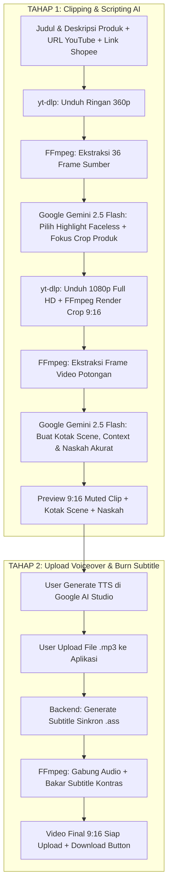

# 🎬 AI Affiliate Clipper VPS

> 🚀 **Project Status: Deployed on Ubuntu 22.04 LTS VPS**  
> Repository GitHub: [https://github.com/Zozodoank/clippervps.git](https://github.com/Zozodoank/clippervps.git)  
> Server Host: `208.76.40.194` | SSH Port: `14115` | Managed by **PM2** & **Cloudflare Tunnel**

Web application berbasis **React (Vite)** dan **Node.js (Express)** yang bertugas mengotomatisasi pengubahan video YouTube menjadi **video reels vertikal 9:16 viral & high-converting** untuk promosi **Shopee Affiliate Marketing**. Seluruh pemrosesan berat (download YouTube 1080p, ekstraksi frame, FFmpeg rendering, dan AI vision) dijalankan di server VPS cloud.

---

## ⚡ Cara Menjalankan & Mengontrol VPS

### 1. Dari Komputer / Laptop Windows (Metode Praktis)
Cukup klik dua kali file **[`JALANKAN_VPS.cmd`](./JALANKAN_VPS.cmd)** di folder ini:
* **Menu [1]**: Jalankan aplikasi interaktif & otomatis forward port ke browser `http://localhost:3000`. Script otomatis memeriksa dan menarik update terbaru dari GitHub (`git fetch & git pull`) sebelum aplikasi dijalankan.
* **Menu [2]**: Memantau log real-time server VPS (PM2).
* **Menu [3]**: Menampilkan link publik Cloudflare Tunnel aktif.
* **Menu [4]**: Membuka terminal bash VPS.

### 2. Dari HP Android (Termux)
Panduan lengkap menjalankan dan menghubungkan dari HP Android dapat dilihat di:  
👉 **[CARA_JALANKAN_TERMUX.md](./CARA_JALANKAN_TERMUX.md)**

### 3. Akses Publik (Cloudflare Tunnel)
Aplikasi selalu aktif di background server VPS dan dapat diakses dari browser manapun melalui URL HTTPS publik yang tercatat di file `.env` (`CLOUDFLARE_TUNNEL_URL`).

### 4. 🔐 Kunci Akses API (Wajib untuk VPS Publik)
Karena URL tunnel bersifat publik, siapa pun yang mengetahui URL dapat mengontrol server. Aktifkan kunci akses:
1. Generate token acak: `openssl rand -hex 24`
2. Isi di `server/.env`: `API_ACCESS_TOKEN=<token-anda>`
3. Restart server, lalu di aplikasi klik tombol **Kunci** (ikon kunci, kanan atas) dan masukkan token yang sama.

Tanpa token ini, endpoint seperti restart server, upload cookies, dan generate video terbuka untuk umum. Laporan lengkap: [`AUDIT_PERBAIKAN_MENYELURUH.md`](./AUDIT_PERBAIKAN_MENYELURUH.md).

---

## 🌟 2-Stage Workflow Overview



---

## 🎯 5 Output Tab Kreatif Siap Pakai

1. **🎬 Kotak Scene**: Rincian per adegan (`timeRange`, deskripsi visual adegan, teks narasi spoken line, dan catatan sutradara *Ad Advisor* seperti SFX & text-on-screen).
2. **📋 Sample Context**: Rangkuman nama produk, target audiens, masalah utama yang diselesaikan (*pain points*), keunggulan utama (USPs), dan trigger psikologis pembelian.
3. **🎙️ Naskah Voiceover (ID)**: Format standar *Ad Advisor* (`[HOOK 0-3s]` → `[DEMO & BENEFIT 3-20s]` → `[VALUE PROPOSITION 20-35s]` → `[CALL TO ACTION 35-60s]`) berbasis judul & deskripsi produk spesifik.
4. **🤖 Prompt Google AI Studio**: Prompt terstruktur siap copy-paste langsung ke Google AI Studio untuk generate TTS audio.
5. **📱 Reels Caption & Shopee Link**: Caption siap posting lengkap dengan emoji, hashtag viral (#racunshopee, #spillracun, dll.), dan link Shopee Affiliate Anda.

---

## 🚀 Cara Menjalankan Aplikasi Secara Lokal / Termux

### Setup Termux pertama kali
```bash
cd ~/clipper
bash setup-termux.sh
nano server/.env
```

Isi minimal:
```bash
GEMINI_API_KEY=isi_api_key_gemini_anda
GEMINI_MODEL=gemini-3.6-flash
```

Jika `GEMINI_API_KEY` baru ditambahkan saat server sudah berjalan, klik **Check** di status engine atau restart server agar `.env` dibaca ulang. Backend juga akan reload `.env` otomatis saat request generate berikutnya.

### 1. Buka Terminal di Folder Proyek
```bash
cd clipperVPS        # folder hasil git clone
# atau di Termux: cd ~/clipper
```

### 2. Jalankan Server & Client Bersamaan
```bash
npm run dev
```

> **Alamat Layanan:**
> - **Frontend (React/Vite)**: `http://localhost:3000`
> - **Backend (Express API)**: `http://localhost:5000`

---

## 📱 Panduan Penggunaan 2-Tahap

1. **Tahap 1 (Clipping & Scripting)**:
   - Pastikan `GEMINI_API_KEY` sudah terisi di file `server/.env` (Dapatkan gratis di [aistudio.google.com](https://aistudio.google.com)).
   - Masukkan **Judul / Nama Produk** (Contoh: *Mini Portable Blender USB 350ml Rechargeable*).
   - Masukkan **Deskripsi & Spesifikasi Produk** (Poin penting & keunggulan barang).
   - Masukkan **YouTube Video URL** dan **Shopee Affiliate Link**.
   - Klik **"Generate Kotak Scene & Video 9:16"**.
   - **Google Gemini 2.5 Flash** menganalisis 36 frame visual, memilih cuplikan peragaan produk tanpa wajah, dan membuat Kotak Scene & Naskah Ad Advisor.
   - **FFmpeg** merender video 9:16 bersih tanpa audio bawaan YouTube.
2. **Tahap 2 (Upload Voiceover & Finalisasi)**:
   - Buka tab **Prompt Google AI Studio** atau **Naskah Voiceover** dan copy teksnya.
   - Generate audio TTS di [Google AI Studio](https://aistudio.google.com) lalu download file `.mp3`.
   - Drag & drop file `.mp3` ke kotak **Tahap 2: Upload Voiceover AI Studio**.
   - Klik **"Gabungkan Voiceover & Bakar Subtitle (Final Video)"**.
   - Preview video final dengan subtitle dan klik **Download Video .mp4 (Final with Subtitles)**.

---

## ☁️ Panduan Codespaces & Termux (Hemat Kuota)

Aplikasi secara default mengaktifkan fitur **Smart Two-Stage Download** untuk menghemat kuota internet hingga **90%**:
1. **Tahap 1 (Analisa Ringan 360p):** Video diunduh dalam format ultra-ringan (hanya berukuran **~1 - 3 MB**) untuk diekstrak framenya dan dianalisis oleh AI Vision.
2. **Eliminasi Cepat:** Jika kandidat video tidak cocok, kandidat langsung dibuang tanpa mengunduh video berat.
3. **Tahap 2 (Unduh 1080p Full HD HANYA untuk Video yang Lolos):** Begitu AI memvalidasi video layak dipotong, barulah sistem mendownload video 1080p Full HD asli untuk proses pemotongan 9:16 vertikal dan dubbing voiceover.

*(Opsional)* Anda dapat mengatur `LOW_DATA_MODE=true` atau `LOW_DATA_MODE=false` di file `server/.env`.
