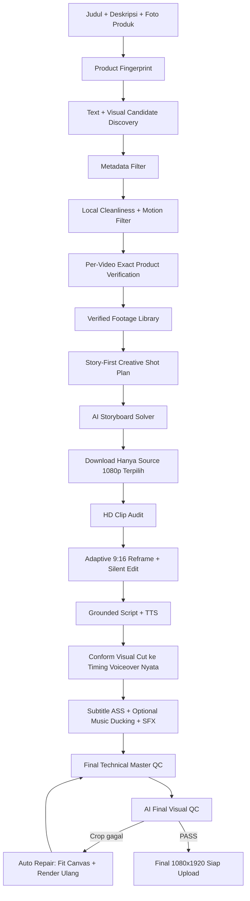

# 🎬 AI Affiliate Clipper VPS

> 🚀 **Project Status: Deployed on Ubuntu 22.04 LTS VPS**  
> Repository GitHub: [https://github.com/Zozodoank/clippervps.git](https://github.com/Zozodoank/clippervps.git)  
> Server Host: `208.76.40.194` | SSH Port: `14115` | Managed by **PM2** & **Cloudflare Tunnel**

Web application berbasis **React (Vite)** dan **Node.js (Express)** yang bertugas mengotomatisasi pengubahan video YouTube menjadi **video reels vertikal 9:16 viral & high-converting** untuk promosi **Shopee Affiliate Marketing**. Seluruh pemrosesan berat (download YouTube 1080p, ekstraksi frame, FFmpeg rendering, dan AI vision) dijalankan di server VPS cloud.

---

## ⚡ Cara Menjalankan & Mengontrol VPS

### 1. Dari Komputer / Laptop Windows (Metode Praktis)
Cukup klik dua kali file **[`JALANKAN_VPS.cmd`](file:///c:/Users/SEMOGA%20AWET/Documents/clipperVPS/JALANKAN_VPS.cmd)** di folder ini:
* **Menu [1]**: Jalankan aplikasi interaktif & otomatis forward port ke browser `http://localhost:3000`. Script otomatis memeriksa dan menarik update terbaru dari GitHub (`git fetch & git pull`) sebelum aplikasi dijalankan.
* **Menu [2]**: Memantau log real-time server VPS (PM2).
* **Menu [3]**: Menampilkan link publik Cloudflare Tunnel aktif.
* **Menu [4]**: Membuka terminal bash VPS.

### 2. Dari HP Android (Termux)
Panduan lengkap menjalankan dan menghubungkan dari HP Android dapat dilihat di:  
👉 **[CARA_JALANKAN_TERMUX.md](file:///c:/Users/SEMOGA%20AWET/Documents/clipperVPS/CARA_JALANKAN_TERMUX.md)**

### 3. Akses Publik (Cloudflare Tunnel)
Aplikasi selalu aktif di background server VPS dan dapat diakses dari browser manapun melalui URL HTTPS publik yang tercatat di file `.env` (`CLOUDFLARE_TUNNEL_URL`).

---

## 🌟 Professional Story-First Workflow



### Prinsip kualitas utama

- **Exact product sebelum pooling:** frame yang bersih belum tentu produknya benar. Setiap kandidat harus lolos verifikasi jenis, mekanisme, konstruksi, dan brand/model bila memang diketahui.
- **Konsistensi lebih penting daripada banyak sumber:** satu video exact-product yang kaya adegan diprioritaskan. Sumber tambahan hanya dipakai jika benar-benar diperlukan dan sudah lolos verifikasi.
- **Story-first:** sistem membuat kebutuhan shot (hook, hero, mekanisme, aksi, hasil, CTA) lalu memilih footage yang memenuhi peran tersebut.
- **Pacing adaptif:** durasi scene tidak lagi dipaksa sama. Hook bisa pendek, demonstrasi bisa lebih panjang sesuai kebutuhan.
- **Voiceover mengontrol final timing:** setelah TTS selesai, visual dikonform ulang ke durasi suara aktual. Video tidak di-loop untuk menutupi voiceover yang terlalu panjang.
- **Final Master QC wajib:** job baru dianggap selesai setelah lolos pemeriksaan resolusi, durasi, audio, black/freeze frame, subtitle safe-zone, dan visual composition final.

### Konfigurasi finishing opsional

Tambahkan ke `server/.env` bila aset tersedia:

```bash
# Musik latar lokal. Kosong = tanpa musik.
BACKGROUND_MUSIC_PATH=/path/to/background_music.mp3
BACKGROUND_MUSIC_VOLUME=0.10

# SFX lokal opsional pada pergantian shot.
SFX_CLICK_PATH=/path/to/click.wav
SFX_WHOOSH_PATH=/path/to/whoosh.wav

# Final AI visual QC aktif secara default.
# false = hanya gunakan Technical Master QC.
FINAL_AI_QC=true

# Jika true, outage/error AI Final QC membuat job gagal.
# Default false: outage AI QC fallback ke Technical Master QC.
FINAL_AI_QC_STRICT=false
```

> Musik/SFX tidak wajib. Pipeline tetap menghasilkan final video dengan voiceover, subtitle, loudness normalization, dan Master QC tanpa aset tersebut.

---

## 🎯 5 Output Tab Kreatif Siap Pakai

1. **🎬 Kotak Scene**: Rincian per adegan (`timeRange`, deskripsi visual adegan, teks narasi spoken line, dan catatan sutradara *Ad Advisor* seperti SFX & text-on-screen).
2. **📋 Sample Context**: Rangkuman nama produk, target audiens, masalah utama yang diselesaikan (*pain points*), keunggulan utama (USPs), dan trigger psikologis pembelian.
3. **🎙️ Naskah Voiceover (ID)**: Format standar *Ad Advisor* (`[HOOK 0-3s]` → `[DEMO & BENEFIT 3-20s]` → `[VALUE PROPOSITION 20-35s]` → `[CALL TO ACTION 35-60s]`) berbasis judul & deskripsi produk spesifik.
4. **🤖 Prompt Google AI Studio**: Prompt terstruktur siap copy-paste langsung ke Google AI Studio untuk generate TTS audio.
5. **📱 Reels Caption & Shopee Link**: Caption siap posting lengkap dengan emoji, hashtag viral (#racunshopee, #spillracun, dll.), dan link Shopee Affiliate Anda.

---

## 🚀 Cara Menjalankan Aplikasi Secara Lokal / Termux

### Setup Termux pertama kali
```bash
cd ~/clipper
bash setup-termux.sh
nano server/.env
```

Isi minimal:
```bash
GEMINI_API_KEY=isi_api_key_gemini_anda
GEMINI_MODEL=gemini-3.6-flash
```

Jika `GEMINI_API_KEY` baru ditambahkan saat server sudah berjalan, klik **Check** di status engine atau restart server agar `.env` dibaca ulang. Backend juga akan reload `.env` otomatis saat request generate berikutnya.

### 1. Buka Terminal di Folder Proyek
```bash
cd "c:\Users\SEMOGA AWET\Documents\clipper"
# atau di Termux: cd ~/clipper
```

### 2. Jalankan Server & Client Bersamaan
```bash
npm run dev
```

> **Alamat Layanan:**
> - **Frontend (React/Vite)**: `http://localhost:3000`
> - **Backend (Express API)**: `http://localhost:5000`

---

## 📱 Panduan Penggunaan & Finalisasi

1. **Tahap 1 (Clipping & Scripting)**:
   - Pastikan `GEMINI_API_KEY` sudah terisi di file `server/.env` (Dapatkan gratis di [aistudio.google.com](https://aistudio.google.com)).
   - Masukkan **Judul / Nama Produk** (Contoh: *Mini Portable Blender USB 350ml Rechargeable*).
   - Masukkan **Deskripsi & Spesifikasi Produk** (Poin penting & keunggulan barang).
   - Masukkan **YouTube Video URL** dan **Shopee Affiliate Link**.
   - Klik **"Generate Kotak Scene & Video 9:16"**.
   - Pipeline menyaring kandidat, memverifikasi exact-product per video, lalu memilih source paling konsisten.
   - AI menyusun storyboard berdasarkan peran shot dan FFmpeg merender edit 9:16 dengan pacing adaptif.
   - Backend dapat membuat TTS otomatis; jika TTS berhasil, visual dikonform ulang ke timing suara sebelum final render.
2. **Tahap 2 (Upload Voiceover & Finalisasi)**:
   - Buka tab **Prompt Google AI Studio** atau **Naskah Voiceover** dan copy teksnya.
   - Generate audio TTS di [Google AI Studio](https://aistudio.google.com) lalu download file `.mp3`.
   - Drag & drop file `.mp3` ke kotak **Tahap 2: Upload Voiceover AI Studio**.
   - Klik **"Gabungkan Voiceover & Bakar Subtitle (Final Video)"**.
   - Backend menolak looping footage, melakukan loudness normalization, lalu menjalankan Technical + AI Final Master QC.
   - Jika AI menemukan crop terlalu agresif, sistem mencoba auto-repair `fit_canvas` dan QC ulang.
   - Video hanya ditandai **completed** setelah lolos QC.

---

## ☁️ Panduan Codespaces & Termux (Hemat Kuota)

Aplikasi secara default mengaktifkan fitur **Smart Two-Stage Download** untuk menghemat kuota internet hingga **90%**:
1. **Tahap 1 (Analisa Ringan 360p):** Video diunduh dalam format ultra-ringan (hanya berukuran **~1 - 3 MB**) untuk diekstrak framenya dan dianalisis oleh AI Vision.
2. **Eliminasi Cepat:** Jika kandidat video tidak cocok, kandidat langsung dibuang tanpa mengunduh video berat.
3. **Tahap 2 (Unduh 1080p Full HD HANYA untuk Video yang Lolos):** Begitu AI memvalidasi video layak dipotong, barulah sistem mendownload video 1080p Full HD asli untuk proses pemotongan 9:16 vertikal dan dubbing voiceover.

*(Opsional)* Anda dapat mengatur `LOW_DATA_MODE=true` atau `LOW_DATA_MODE=false` di file `server/.env`.
