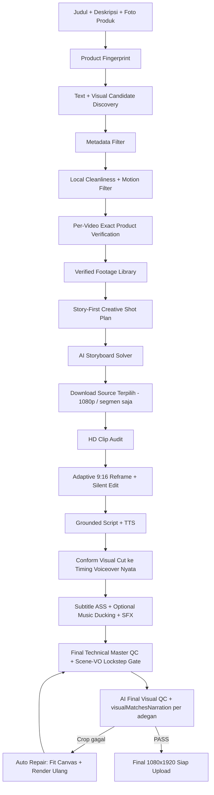

# 🎬 AI Affiliate Clipper

> 💻 **Project Status: Berjalan sepenuhnya lokal di perangkat Anda (PC Windows & HP Android/Termux)**  
> Repository GitHub: [https://github.com/Zozodoank/clippervps.git](https://github.com/Zozodoank/clippervps.git)  
> ClipperVPS berjalan lokal di Windows atau Android/Termux. Seluruh keputusan visual dilakukan Oracle Kaggle; setiap gambar yang dikirim dipastikan berasio 9:16. Voice-over memakai Gemini TTS.

Web application berbasis **React (Vite)** dan **Node.js (Express)** yang bertugas mengotomatisasi pengubahan video YouTube menjadi **video reels vertikal 9:16 viral & high-converting** untuk promosi **Shopee Affiliate Marketing**. Seluruh pemrosesan berat (analisa stream, ekstraksi frame, FFmpeg rendering, dan AI vision) dijalankan langsung di perangkat Anda (tanpa server cloud).

---

## ⚡ Cara Menjalankan Secara Lokal

### 1. Dari Komputer / Laptop Windows (Lokal)
Jalankan dari terminal di folder proyek:
```bash
npm install
npm run dev
```
`dev-runner.js` menyalakan Backend (`:5000`) dan Frontend (`:3000`). Oracle Kaggle menjadi satu-satunya pemutus visual.

### 2. Dari HP Android (Termux)
Panduan lengkap menjalankan langsung di HP Android (Termux) dapat dilihat di:  
👉 **[CARA_JALANKAN_TERMUX.md](file:///c:/Users/SEMOGA%20AWET/Documents/clipperVPS/CARA_JALANKAN_TERMUX.md)**


---

## 🌟 Professional Story-First Workflow


```mermaid
flowchart TD
    A[Judul + Deskripsi + Foto Produk] --> B[Product Fingerprint]
    B --> C[Text + Visual Candidate Discovery]
    C --> D[Metadata Filter]
    D --> E[Local Cleanliness + Motion Filter]
    E --> F[Per-Video Exact Product Verification]
    F --> G[Verified Footage Library]
    G --> H[Story-First Creative Shot Plan]
    H --> I[AI Storyboard Solver]
    I --> J[Download Source Terpilih - 1080p / segmen saja]
    J --> K[HD Clip Audit]
    K --> L[Adaptive 9:16 Reframe + Silent Edit]
    L --> M[Grounded Script + TTS]
    M --> N[Conform Visual Cut ke Timing Voiceover Nyata]
    N --> O[Subtitle ASS + Optional Music Ducking + SFX]
    O --> P[Final Technical Master QC + Scene-VO Lockstep Gate]
    P --> Q[AI Final Visual QC + visualMatchesNarration per adegan]
    Q -->|Crop gagal| R[Auto Repair: Fit Canvas + Render Ulang]
    R --> P
    Q -->|PASS| S[Final 1080x1920 Siap Upload]
```

### Prinsip kualitas utama

- **Exact product sebelum pooling:** frame yang bersih belum tentu produknya benar. Setiap kandidat harus lolos verifikasi jenis, mekanisme, konstruksi, dan brand/model bila memang diketahui.
- **Konsistensi lebih penting daripada banyak sumber:** satu video exact-product yang kaya adegan diprioritaskan. Sumber tambahan hanya dipakai jika benar-benar diperlukan dan sudah lolos verifikasi.
- **Story-first:** sistem membuat kebutuhan shot (hook, hero, mekanisme, aksi, hasil, CTA) lalu memilih footage yang memenuhi peran tersebut.
- **Pacing adaptif:** durasi scene tidak lagi dipaksa sama. Hook bisa pendek, demonstrasi bisa lebih panjang sesuai kebutuhan.
- **Voiceover mengontrol final timing:** setelah TTS selesai, visual dikonform ulang ke durasi suara aktual. Video tidak di-loop untuk menutupi voiceover yang terlalu panjang.
- **Final Master QC wajib:** job baru dianggap selesai setelah lolos pemeriksaan resolusi, durasi, audio, black/freeze frame, subtitle safe-zone, dan visual composition final.

### Face Policy & Scene↔VO Lockstep (khusus niche `gadget_smartphone`)

Dikelola **100% lewat data di `server/config/nichePresets.js`** — tidak ada `if (niche)` di service:

- **Kebijakan wajah dan kebersihan frame:** frame tidak disaring oleh komponen screening lokal yang sudah dihapus. Semua keputusan visual, termasuk wajah, teks, watermark, grafis, dan kecocokan produk, diminta kepada Oracle Kaggle.
- **`strictSceneVoSync: true` pada preset gadget:** ekspansi loop klip saat conform dilarang; jumlah adegan wajib sama persis dengan baris voiceover. Segment plan `[{slot, timeStart, voLine, visualClaim}]` dihitung setiap conform (`sceneVoSegments` di job), divalidasi `validateScriptSlotAlignment`, dan dijadikan bahan Final QC: gate deterministik `auditSceneVoLockstep` + pemeriksaan AI `visualMatchesNarration` per adegan (field `narrationMismatch`).
- Pemeriksaan verifikasi Oracle dan pemformatan JPEG 9:16 berada di `server/services/vlmOracleService.js`.

### Konfigurasi finishing opsional

Tambahkan ke `server/.env` bila aset tersedia:

```bash
# Musik latar lokal. Kosong = tanpa musik.
BACKGROUND_MUSIC_PATH=/path/to/background_music.mp3
BACKGROUND_MUSIC_VOLUME=0.10

# SFX lokal opsional pada pergantian shot.
SFX_CLICK_PATH=/path/to/click.wav
SFX_WHOOSH_PATH=/path/to/whoosh.wav

# Final AI visual QC aktif secara default.
# false = hanya gunakan Technical Master QC.
FINAL_AI_QC=true

# Jika true, outage/error AI Final QC membuat job gagal.
# Default false: outage AI QC fallback ke Technical Master QC.
FINAL_AI_QC_STRICT=false
```

> Musik/SFX tidak wajib. Pipeline tetap menghasilkan final video dengan voiceover, subtitle, loudness normalization, dan Master QC tanpa aset tersebut.

---

## 🎯 5 Output Tab Kreatif Siap Pakai

1. **🎬 Kotak Scene**: Rincian per adegan (`timeRange`, deskripsi visual adegan, teks narasi spoken line, dan catatan sutradara *Ad Advisor* seperti SFX & text-on-screen).
2. **📋 Sample Context**: Rangkuman nama produk, target audiens, masalah utama yang diselesaikan (*pain points*), keunggulan utama (USPs), dan trigger psikologis pembelian.
3. **🎙️ Naskah Voiceover (ID)**: Format standar *Ad Advisor* (`[HOOK 0-3s]` → `[DEMO & BENEFIT 3-20s]` → `[VALUE PROPOSITION 20-35s]` → `[CALL TO ACTION 35-60s]`) berbasis judul & deskripsi produk spesifik.
4. **🤖 Prompt Google AI Studio**: Prompt terstruktur siap copy-paste langsung ke Google AI Studio untuk generate TTS audio.
5. **📱 Reels Caption & Shopee Link**: Caption siap posting lengkap dengan emoji, hashtag viral (#racunshopee, #spillracun, dll.), dan link Shopee Affiliate Anda.

---

## 🚀 Cara Menjalankan Aplikasi Secara Lokal / Termux

### Setup Termux pertama kali
```bash
cd ~/clipper
bash setup-termux.sh
nano server/.env
```

Isi minimal:
```bash
GEMINI_API_KEY=isi_api_key_gemini_anda
GEMINI_MODEL=gemini-3.6-flash
```

Jika `GEMINI_API_KEY` baru ditambahkan saat server sudah berjalan, klik **Check** di status engine atau restart server agar `.env` dibaca ulang. Backend juga akan reload `.env` otomatis saat request generate berikutnya.

### 1. Buka Terminal di Folder Proyek
```bash
cd "c:\Users\SEMOGA AWET\Documents\clipper"
# atau di Termux: cd ~/clipper
```

### 2. Jalankan Server & Client Bersamaan
```bash
npm run dev
```

> **Alamat Layanan:**
> - **Frontend (React/Vite)**: `http://localhost:3000`
> - **Backend (Express API)**: `http://localhost:5000`

---

## 📱 Panduan Penggunaan & Finalisasi

1. **Tahap 1 (Clipping & Scripting)**:
   - Pastikan `GEMINI_API_KEY` sudah terisi di file `server/.env` (Dapatkan gratis di [aistudio.google.com](https://aistudio.google.com)).
   - Masukkan **Judul / Nama Produk** (Contoh: *Mini Portable Blender USB 350ml Rechargeable*).
   - Masukkan **Deskripsi & Spesifikasi Produk** (Poin penting & keunggulan barang).
   - Masukkan **YouTube Video URL** dan **Shopee Affiliate Link**.
   - Klik **"Generate Kotak Scene & Video 9:16"**.
   - Pipeline menyaring kandidat, memverifikasi exact-product per video, lalu memilih source paling konsisten.
   - AI menyusun storyboard berdasarkan peran shot dan FFmpeg merender edit 9:16 dengan pacing adaptif.
   - Backend dapat membuat TTS otomatis; jika TTS berhasil, visual dikonform ulang ke timing suara sebelum final render.
2. **Tahap 2 (Upload Voiceover & Finalisasi)**:
   - Buka tab **Prompt Google AI Studio** atau **Naskah Voiceover** dan copy teksnya.
   - Generate audio TTS di [Google AI Studio](https://aistudio.google.com) lalu download file `.mp3`.
   - Drag & drop file `.mp3` ke kotak **Tahap 2: Upload Voiceover AI Studio**.
   - Klik **"Gabungkan Voiceover & Bakar Subtitle (Final Video)"**.
   - Backend menolak looping footage, melakukan loudness normalization, lalu menjalankan Technical + AI Final Master QC.
   - Jika AI menemukan crop terlalu agresif, sistem mencoba auto-repair `fit_canvas` dan QC ulang.
   - Video hanya ditandai **completed** setelah lolos QC.

---

## 💾 Cara Sistem Menghemat Kuota

Sistem **tidak** mengunduh video penuh untuk menganalisa kandidat. Penghematan terjadi berlapis:

1. **Metadata-only (0 unduh video):** judul, durasi, resolusi maksimal, dan URL stream diambil lewat yt-dlp `--dump-json` (±30–600 KB/kandidat). Kandidat beresolusi <720p atau durasi di luar 50s–15mnt langsung ditolak di sini.
2. **Frame sampling langsung dari stream HLS:** FFmpeg mengekstrak frame, lalu backend mengubah setiap gambar yang dikirim menjadi JPEG tepat 9:16 dengan letterbox agar gambar sumber tidak terpotong. Kaggle membuat seluruh keputusan visual.
3. Kandidat dinilai Oracle Kaggle; kegagalan ekstraksi atau Oracle diperlakukan sebagai gangguan sistem, bukan penolakan produk.
4. **Unduh 1080p HANYA untuk source terpilih:** setelah AI menyetujui storyboard, barulah video sumber diunduh untuk render. Ini pos kuota terbesar (rata-rata ±81 MB/file terukur).

### Flag hemat kuota tahap render (`server/.env`) — semua default aman untuk PC
| Flag | Default | Fungsi |
|---|---|---|
| `RENDER_VIDEO_ONLY` | ON | Jangan unduh audio sumber (selalu dibuang `-an`, VO dibuat sendiri). Murni hemat, nol efek kualitas. Set `0` untuk tetap unduh audio. |
| `RENDER_MAX_HEIGHT` | `1080` | Cap tinggi video render (format terbaik yang diunduh). Default 1080 di SEMUA mesin, termasuk Termux (keputusan: hasil akhir dipaksa 1080p pada semua mode + retry). Sampling/verifikasi tetap 360p/480p murah. Turunkan ke `720` hanya bila bersedia render lebih lambat & panas di T7250. |
| `RENDER_DOWNLOAD_SECTIONS` | OFF | `1` = unduh HANYA segmen klip yang dipakai (`yt-dlp --download-sections`), potensi hemat 80–95%. Bila satu segmen gagal, otomatis fallback ke unduhan penuh. |
| `RENDER_SECTION_PAD` / `_TAIL_PAD` / `_GAP` | `2` / `5` / `15` | Tuning pengelompokan segmen (detik). Hanya aktif saat `RENDER_DOWNLOAD_SECTIONS=1`. |
| `DOWNLOAD_ARCHIVE_PATH` | OFF | Anti unduh ulang videoId yang sama lintas job. Aktifkan HANYA bila folder output render persisten. |

> **Render di Termux:** default SAMA dengan PC = `RENDER_MAX_HEIGHT=1080` (keputusan: kualitas akhir dipaksa 1080p di semua mode). Nilai ini ikut **dibekukan per-job** di `configSnapshot`, sehingga retry mereproduksi tinggi yang sama walau `.env` sudah berubah. Bila kelak ingin hemat kuota/CPU, set `RENDER_MAX_HEIGHT=720` manual di `server/.env` Termux. Untuk menjamin sumber memang >720p, gerbang metadata `checkVideoMetadataCompliance` menegakkannya otomatis — **syarat: `cookies.txt` tersedia** agar probe format terpercaya (tanpa cookies YouTube membatang daftar format ke 360p, sehingga penolakan keras dilewati).

> Estimasi nyata: **±150–270 MB per job selesai** di PC (didominasi unduhan render 1080p). Dengan **720p + download-sections** bisa turun ke kisaran **±35–90 MB/job**.

### Sampling frame bisa diperlonggar bila kuota sangat mepet
Jumlah frame analisa dihitung dari durasi dan interval sampling (cap 500). Menurunkan cap mengurangi data yang dianalisis, tetapi juga mengurangi cakupan temporal.

### Token meter: ukur dulu, baru kurangi (Lapis 1)
Sebelum ada fitur ini, satu-satunya "angka token" di repo adalah konstanta karangan (`2500`/`3500` di `bandwidthTracker`) — jadi tidak ada yang tahu tahap mana yang benar-benar mahal. Sekarang pemakaian **sesungguhnya** dicatat ke tabel `ai_usage_events` di `jobs.db`: `usageMetadata` Gemini untuk 6 titik `generateContent` (termasuk Visual/File API yang mengunggah MP4 pre-flight), plus `usage` dan biaya untuk **semua** panggilan chat (dijepit di satu titik: pembungkus `fetch` pada `services/ai/aiClient.js`). Dibaca lewat `GET /api/ai-usage?hours=24&detail=1`.

Yang bisa dibandingkan antar-niche ada di `perClip`: **`tokensPerCompletedClip`** = total token dibagi jumlah **klip jadi**. Penyebutnya sengaja ketat (`stage='completed'` DAN ada file keluaran), dan yang masih berjalan dilaporkan terpisah sebagai `unfinishedJobs` karena token mereka sudah terpakai tapi klipnya belum ada — jadi angkanya adalah **batas atas**. Tanpa filter `jobId` field ini tidak muncul (satu job = penyebut 1 = angka tidak bermakna). Pencatatan tidak pernah bisa menggagalkan job: kalau DB terkunci, yang hilang cuma satu baris statistik. Matikan lewat `AI_USAGE_RECORD=0`; hidupkan log per-panggilan dengan `AI_USAGE_LOG=1`.

---

## 🛰️ VLM Oracle — vonis frame oleh model besar di Kaggle (opsional)

Oracle Kaggle adalah satu-satunya pemutus visual. Gatekeeper lokal dan SmolVLM lokal tidak dijalankan oleh aplikasi. Setiap frame dikonversi ke kanvas JPEG tepat 9:16 sebelum masuk antrean. Jika konversi atau Oracle gagal, job berhenti tanpa mengirim frame mentah dan tanpa keputusan visual lokal.

**Desain Oracle.** Bobot Vision-Language (default **Qwen2.5-VL-3B-Instruct** fp16 — **satu bobot, rantai fallback antar-model sudah dihapus**; ganti lewat `ORACLE_MODEL_ID` di sisi notebook) dijalankan di **GPU Kaggle**, dan Kaggle **hanya** dipakai untuk analisa frame — seluruh sisanya (yt-dlp, Oracle Kaggle, render) tetap di PC/Termux. Kenapa 3B dan bukan 7B-AWQ: terukur 2026-10-03, round trip 7B **3,5–5,7 s/frame** — lebih lambat dari filter lokal yang sudah dihapus — sementara bobot AWQ pun gagal dimuat di image Kaggle terbaru (butuh `gptqmodel`). Fallback dihapus karena alasan yang sama dengan kalibrasi: kalau sesi boleh berpindah bobot diam-diam, angka recall/false-reject tidak lagi melekat pada model yang tercatat di vonis. Arah koneksi dipaksa oleh fakta bahwa notebook Kaggle tidak punya inbound: **notebook yang menjadi klien** (`claim` → unduh frame → vonis → `result`). Pipeline lokal tidak pernah menelepon Kaggle; ia menulis batch ke antrean SQLite `vlm_oracle_batches` dan menunggu vonis. Notebook boleh mati kapan saja.

**Bukti bahwa T4 benar-benar dipakai (kernel versi 11, 2026-10-03).** Kaggle mencatat `cuda=True`, perangkat Tesla T4 dan dtype float16; sesi dihentikan bila CUDA tidak tersedia.

**Yang terukur dari satu sesi penuh (2026-10-03, kernel versi 9, T4).** Sebelum vonis pertama bisa keluar, sesi baru membayar: **22 s** pip install (`qwen-vl-utils[decord]`) + **21 s** unduh bobot dari Hugging Face + **47 s** muat bobot = **86,7 s** sampai model siap, lalu idle. Angka itu membantah proyeksi "muat 3B ±20 s (2,3× lebih cepat dari 7B)": bobotnya sendiri **±47 s, praktis sama dengan 7B-AWQ (46 s)** yang digantikan, karena yang mendominasi adalah pip + unduhan, bukan ukuran bobot. Yang benar-benar turun hanya jejak VRAM (~6 GB vs ~14 GB) dan hilangnya kebutuhan `gptqmodel`. **Latensi per-frame 3B masih belum terukur** — sesi itu antreannya kosong (`vlm_oracle_batches`: 0 pending) sehingga `vonis=0`; klaim "1,5–2,5 s/frame" dari plan eksternal tetap proyeksi sampai ada batch nyata.

**Kuota — dua sumber Kaggle yang tidak sepakat, jadi jangan pilih salah satu diam-diam.** Tabel CLI `python -m kaggle quota` (2026-10-03): GPU **total 30,00 jam**, terpakai 3,15 jam, sisa 26,85 jam, refresh Jumat. SDK `get_accelerator_quota_statistics` (dibaca oleh `python scratch/kaggle_session_probe.py`, dan ini yang dipakai penegas sesi): `totalTimeAllowed = minimumTimeAllowed = 21600 s = 6 jam` dengan `timeUsed ≈ 11428 s = 3,17 jam`. Yang "terpakai" cocok di keduanya; yang "total" berbeda 5×. Selama belum jelas angka mana yang benar-benar menghentikan sesi, **anggapan kerja tetap 6 jam** (keputusan desain di README ini — memotong sesi boot ke 8–13 menit — diambil dari angka itu), dan baris ini tempat mencatat bila suatu saat terbukti penegakan yang sebenarnya memakai 30 jam. Sesi yang berhenti sendiri (`ORACLE_MAX_MINUTES`) tetap dihitung penuh dari menit pertama, jadi sesi validasi-boot harus sengaja dipotong pendek.

**Tiga penjaga di sisi notebook** (semua teruji offline di `scratch/test_gpu_mount.py`, tanpa GPU): (1) **gerbang GPU** — kalau `torch.cuda.is_available()` False, sesi **berhenti** dengan pesan "set Accelerator ke GPU T4", bukan diam-diam inferensi CPU yang belasan kali lebih lambat sambil tetap memotong kuota; matikan hanya untuk debug lewat `ORACLE_REQUIRE_GPU=0` (atau `deploy.ps1 -AllowCpu`). (2) **dtype fp16, bukan `auto`** — `torch_dtype="auto"` mengambil nilai dari config bobot = **bfloat16**, dan T4 (Turing) tidak punya jalur cepat bf16; sekarang default `float16` dan baris "Model siap" mencetak `cuda=`, nama perangkat, posisi bobot (`cuda:0`), dan dtype, sehingga vonis tidak bisa lagi datang dari perangkat yang tidak tercatat. (3) **bobot dari mount, bukan unduhan** — `model_sources` Kaggle (mis. `qwen-lm/qwen2.5-vl/transformers/3b-instruct/2` lewat `deploy.ps1 -ModelSource`) di-mount read-only di bawah `/kaggle/input`, dan worker mengenali snapshotnya **dari isi direktori** (`config.json` arsitektur `Qwen2_5_VL` + bobot sungguhan), bukan dari menebak path — karena segmen nama mount ditentukan pembuat modelnya. Kalau ketemu, bobot tidak diunduh sama sekali dan label di verdict ikut nama mount (`qwen2.5-vl-3b-instruct`), bukan nomor versi. **Catatan yang terukur:** mirror Kaggle Models punya `preprocessor_config.json` yang ditolak `AutoProcessor` ("Unrecognized image processor" — sesi kernel v10 mati di sini), jadi `load_processor()` mengambil processor dari HF id secara terpisah (file kecil, **3,6 s**) sambil tetap memakai bobot dari mount — sumber BOBOT tidak pernah berpindah diam-diam. Hasil bersihnya di kernel v11: muat bobot **22 s** (bukan 47 s) dan siap pakai **62,3 s** (bukan 86,7 s). `HF_TOKEN` (di `server/.env`, ikut ke dataset konfigurasi privat) hanya mempercepat unduhan; bukan syarat bisa jalan.

**Kebijakan Oracle.** Kaggle memutuskan kualitas visual. Bila notebook tidak menjawab, timeout, bobot gagal dimuat, atau vonis tidak sah, job dihentikan. Tidak ada fallback keputusan visual lokal.

**Tiga titik veto.** (1) **Pre-flight pass** — sebelum kandidat mana pun diunduh, 2-3 kandidat pertama di antrian dinilai dari **15 frame @1 fps** (360p, satu batch per kandidat) hasil FFmpeg langsung dari stream, lalu Kaggle-lah yang **memeringkat** dan hanya 2 terbaik yang bertahan. Ini menggantikan panggilan Gemini File API yang mengunggah MP4 per kandidat (matikan dengan pre-flight Gemini sudah dihapus). Beda dengan dua pass berikutnya: di sini kandidat memang **dibuang**, tapi hanya yang benar-benar divisit — yang tidak dijawab oracle tetap dicoba lewat jalur normal. (2) **Pool pass** — sebelum storyboard, frame pool divisit dan yang kotor jadi `blacklistedFramePaths` (plafon `VLM_ORACLE_MAX_FRAMES`). (3) **Clip pass** di tahap `clip_audit` — sesudah klip final terbentuk dari file section hasil `--download-sections`, frame yang **sudah** diekstrak pada `sampleStepSec = 0.40` (2,5 fps) divisit **per klip**; klip yang kotor masuk `discardedDirtyClips` dengan reason `ORACLE_DIRTY` dan dipulihkan oleh mesin recovery yang sudah ada (Slot 1 restore + `pooledFrames`). Tidak ada ekstraksi FFmpeg tambahan di clip pass, dan vonis hanya jatuh bila oracle benar-benar menjawab. Urutan dalam loop tidak berubah: gerbang motion (SSIM) tetap lebih dulu karena murah, oracle sesudahnya karena mahal. Yang memveto di sini adalah model besar di GPU — bukan ClipAudit lokal, yang memang dilarang menolak klip karena teks/wajah.

**Peringkat kandidat = kontrak vonis yang lebih luas.** Pre-flight memakai prompt dari `buildVlmPrompt(..., { requireRanking: true })` yang menambah dua kunci: `productMatch` (apakah yang tampak memang produk yang diuji, bukan sekadar gadget sejenis) dan `matchScore` 0-100. Notebook menyalakan mode ini dengan **mendeteksi kata `matchScore` di dalam prompt**, jadi server dan Kaggle boleh di-deploy terpisah. Skor agregat = **median** bukti per-frame (satu frame yang dihalusinasi `100` tidak menyeret kandidat), `null` berarti "tidak ada informasi" dan sengaja **bukan** `0`. Pass pool dan clip pass tidak pernah meminta konteks produk, sehingga vonis tanpa kedua kunci itu tetap sah dan `productMatch:false` **tidak ikut** memicu veto kotoran. Urutan pemilihan: bersih dulu, baru `matchScore` turun.

**Frame dikirim 360p, bukan 1080p.** Section tetap diunduh 1080p (`RENDER_DOWNLOAD_SECTIONS`/`RENDER_MAX_HEIGHT` tidak berubah — kualitas sumber jaga), tetapi JPEG yang diserahkan ke notebook di-kecilkan lebih dulu di perangkat (`scale=-2:<h> -q:v 4`, lebar otomatis genap sehingga rasio terjaga). Alasannya byte: terukur **298 KB → 32 KB** pada frame 1080p (±9x lebih kecil), dan visi model juga membayar lebih sedikit vision-token. Salinan hanya ditulis di `server/temp/oracle_frames/<jobId>_h<height>/` (dalam allowlist `isAllowedFramePath`, dibersihkan sapuan usia 6 jam), file asli tidak pernah disentuh, dan **vonis selalu dipetakan balik ke path asli** supaya `blacklistedFramePaths` tetap cocok. File ≤ 200 KB tidak dikecilkan (tidak layak), dan konversi gagal/timeout 20 s → pakai file asli; job tidak pernah dijatuhkan karena urusan ini.

| Flag (`server/.env`) | Default | Fungsi |
|---|---|---|
| `VISION_VERIFY_MODE` | `legacy` | Set `oracle` untuk mengaktifkan lapisan veto model besar. |
| `VLM_ORACLE_MAX_FRAMES` | `120` | Plafon **total** frame per job pada **pool pass** yang dikirim ke GPU (dipilih merata sepanjang garis waktu). `0` = tidak ada yang divisit. |
| `VLM_ORACLE_FRAME_HEIGHT` | `360` | Tinggi target kanvas JPEG yang dikirim ke Kaggle. Lebar ditentukan agar rasio tepat 9:16; nilai 0 tetap dikonversi. Dijepit 240?720. |
| `VLM_ORACLE_AUDIT_MAX_FRAMES` | `90` | Plafon frame untuk **clip pass** (`clip_audit`, dibagi rata antar klip, minimal 2 per klip). Dijepit 8–240; `0` = clip pass dimatikan, pool pass tetap jalan. |
| `VLM_ORACLE_BATCH_SIZE` | `8` | Frame per batch (dijepit 1–16). |
| `VLM_ORACLE_TIMEOUT_SEC` | `180` | Tunggu maksimal per batch. Lewat → lanjut, tidak memveto. |
| `VLM_ORACLE_TOTAL_TIMEOUT_SEC` | `600` | Anggaran waktu seluruh tahap oracle dalam satu job. |
| `VLM_ORACLE_POLL_MS` | `2000` | Interval worker memeriksa vonis. |
| `VLM_ORACLE_STALE_SEC` / `_MAX_ATTEMPTS` | `300` / `2` | Batch `claimed` yang lebih tua dari ini dianggap notebook mati dan dikembalikan ke `pending`; setelah `MAX_ATTEMPTS` ditandai `expired` agar GPU tidak dibuang untuk kerjaan yatim. |
| `PREFLIGHT_ORACLE` | `1` | **Pre-flight pass**: selalu dinilai Kaggle ketika mode Oracle aktif; nilai `0` lama diabaikan. |

### Runbook sisi lokal
1. **Wajib:** isi `API_ACCESS_TOKEN` di `server/.env` (perangkat yang menjalankan server — saat ini Termux), restart server. Endpoint oracle sengaja menjawab **503** selama token kosong, karena pihak yang mengambil data adalah mesin di luar jaringan Anda dan yang diserahkan adalah bingkai video Anda. Token juga satu-satunya gerbang `/api/vlm-oracle/*`; tidak ada sistem secret terpisah.
2. Pastikan tunnel publik aktif (`cloudflared tunnel --url http://localhost:5000`) dan catat URL-nya — quick tunnel **ganti URL setiap restart**, jadi nilai ini harus dikirim ulang ke Kaggle tiap kali (lewat `deploy.ps1`, tanpa membuka UI; lihat Runbook Kaggle).
3. Cek antrean: `GET /api/vlm-oracle/status` (butuh token header `x-api-token`). Endpoint `/vlm-oracle/*` **tidak boleh** dimasukkan ke allowlist publik `tokenAuth` (sudah ada test yang mengunci hal ini).
4. Set `VISION_VERIFY_MODE=oracle` lalu jalankan job seperti biasa. Log menampilkan `[Oracle] ⛔ N/M frame diveto model besar...` untuk pool pass, `🛰️ Oracle Kaggle memvonis klip final` + reason `ORACLE_DIRTY` untuk clip pass, dan `🛰️ Pre-flight Kaggle: N kandidat diterima...` untuk pre-flight.

### Runbook sisi Kaggle (CLI — jalur termudah, tanpa UI)

Kenapa CLI dan bukan copy-paste di UI atau "attach GitHub + Run manual": `kaggle kernels push` membuat Kaggle **langsung menjalankan versi baru**, bisa diulang tiap `kaggle/vlm_oracle_qwen.py` berubah, dan log eksekusi bisa ditarik ke PC. Attach GitHub tidak auto-run per commit dan tidak bisa mengirim argumen.

Satu hal yang harus diakali: **metadata kernel Kaggle tidak bisa memuat env var**, padahal URL quick-tunnel berganti tiap server restart — kalau harus lewat UI, oracle mati tiap hari. Karena itu URL + token dikirim sebagai **dataset privat kecil** (`<user>/clippervps-oracle-config` berisi `oracle_config.json`) yang di-attach ke kernel. Urutan baca worker: **env var Kaggle > `oracle_config.json` > default**, jadi menimpa cepat dari UI tetap mungkin.

```powershell
# 0. Sekali saja: pasang CLI (butuh Python).
python -m pip install --user --upgrade kaggle

# 1. Cek kredensial + staging tanpa mengirim apa pun (tidak ada sesi GPU baru).
#    Kredensial dibaca dari KAGGLE_API_TOKEN di server/.env, fallback kaggle.json.
powershell -ExecutionPolicy Bypass -File kaggle\deploy.ps1 -NoPush

# 2. Hari-H: upload URL tunnel (+ token) lalu push kernel. Tambahkan -Logs untuk
#    menarik log sesi ke scratch/kaggle_out/.
powershell -ExecutionPolicy Bypass -File kaggle\deploy.ps1 -TunnelUrl https://abc-123.trycloudflare.com -WithToken -Logs

# 2b. Versi paling aman: ambil URL tunnel + token LANGSUNG dari .env Termux lewat
#     SSH (parameters sync.config.json), sehingga rahasia tidak pernah Anda salin,
#     tidak dicetak ke terminal, dan tidak masuk git.
powershell -ExecutionPolicy Bypass -File kaggle\deploy.ps1 -FromTermux -Logs

# 3. Tarik log sesi terakhir saja.
powershell -ExecutionPolicy Bypass -File kaggle\deploy.ps1 -Logs -NoPush
```

1. `kaggle/kernel-metadata.example.json` adalah template (`enable_gpu`, `machine_shape: NvidiaTeslaT4`, `enable_internet: true` — wajib untuk pip install + unduh bobot). `deploy.ps1` menyalinnya ke `kaggle/.deploy/kernel-metadata.json` dengan **id asli** + `dataset_sources` hasil langkah 2; folder `.deploy*` sudah di-gitignore karena memuat username, URL tunnel, dan token.
2. **Validasi dulu tanpa memuat bobot:** `deploy.ps1 -FromTermux -NoModel -RunTimeoutSec 300` menulis `ORACLE_NO_MODEL=1` ke dataset konfigurasi (metadata kernel Kaggle tidak bisa memuat env var, jadi kanal dataset yang dipakai) dan mendorong worker berhenti sendiri. Sesi dry-run **tetap mengunduh frame** — justru pengambilan frame yang paling mungkin pecah (allowlist path, file sementara yang sudah dibersihkan, tunnel putus). Bukan gratis: sesi NO_MODEL tetap memegang akselerator jadi tetap dihitung kuota — yang tidak dibayar hanya unduhan + muat bobot. Kalau log menampilkan `claim ...` lalu `dry-run: N/N frame diunduh` dan vonis `{"safe":true,"model":"dry-run"}` masuk ke `vlm_oracle_batches`, tunnel + token + path frame sudah benar. Catatan: jalur NO_MODEL sengaja berhenti sebelum `load_model()`, jadi ia TIDAK membuktikan mount bobot maupun gerbang GPU. Jalankan ulang **tanpa** `-NoModel` untuk muat model sungguhan — dan lihat langkah 2b supaya tidak membayar unduhan Hugging Face tiap sesi.
2b. **Hilangkan unduhan bobot dari tiap sesi (rekomendasi — terukur jalan).** `deploy.ps1 -FromTermux -ModelSource qwen-lm/qwen2.5-vl/transformers/3b-instruct/2` menaruh model Kaggle resmi di `model_sources` kernel; Kaggle me-mount-nya read-only di bawah `/kaggle/input` dan worker mengenalinya dari isi direktori (`Mount bobot terdeteksi`, `Sumber bobot: mount lokal`). Hasil di kernel v11: **siap pakai 62,3 s vs 86,7 s** lewat unduhan — hilangnya ±21 s unduh HF **dan** muat bobot turun 47 s → 22 s (selisih ini tidak terproyeksi; penyebabnya belum diisolasi — sesi v10 bahkan butuh 35 s untuk mount yang sama, jadi ada variansi antar-sesi yang belum kita pahami). `+ pip ±22 s` tetap jalan karena `qwen-vl-utils` bukan bagian dari image. Nilai `-ModelSource` disimpan di `kaggle/.deploy/.model-source` sehingga push berikutnya tidak kembali diam-diam ke jalur unduhan. **Yang tidak ikut hilang:** processor (bukan bobot) tetap diambil dari HF id ±3,6 s karena `preprocessor_config.json` mirror Kaggle ditolak `AutoProcessor` — inilah yang membunuh kernel v10, sekarang di-`try` terpisah dan dicetak di baris "Model siap". `ORACLE_MODEL_MOUNT` tersedia kalau path-nya perlu dipaksa, dan `HF_TOKEN` di `server/.env` ikut ke dataset konfigurasi privat bila tetap ingin jalur unduhan. Bentuk entri `model_sources` di metadata **string dengan 5 segmen**, bukan objek — CLI v2 menolak dict (`AttributeError: 'dict' object has no attribute 'count'`).
3. Notebook looping dan berhenti sendiri setelah `ORACLE_MAX_MINUTES` (default 690 menit, dan `deploy.ps1 -RunTimeoutSec N` menuliskan versi yang lebih kecil ke dataset konfigurasi). **Jangan cuma mengandalkan `-t` Kaggle**: teramati sesi dry-run dengan `-t 1200` masih `RUNNING` setelah 25 menit — batas waktu Kaggle bisa tidak ditegakkan, sedangkan setiap menit di atas GPU dipotong dari kuota mingguan. Kuota akun ini **terukur 21600 detik = 6 jam/minggu lewat SDK penegas sesi** (`python scratch/kaggle_session_probe.py`, membaca `get_accelerator_quota_statistics`), sementara tabel `python -m kaggle quota` mengklaim total 30 jam — keduanya dipakai di README ini apa adanya (lihat paragraf **Kuota**), dan angka 6 jam yang dipakai sebagai anggaran kerja. Karena itu batas diri worker ditulis ke konfigurasi, bukan hanya ke CLI, dan `kaggle/vlm_oracle_qwen.py` sengaja berhenti sebelum claim kalau dependensi model masih kurang. Hentikan manual bila tidak ada job, dan jalankan `deploy.ps1` lagi untuk memulai sesi hari berikutnya.
4. Jangan hard-code token di notebook — log notebook bisa ter-share.

## Kalibrasi lama (tidak digunakan)

Prosedur lama yang memakai label dan endpoint komponen screening lokal yang sudah dihapus sudah tidak berlaku. Job produksi hanya memakai Oracle Kaggle, dan frame yang diunggah wajib berasio 9:16.
