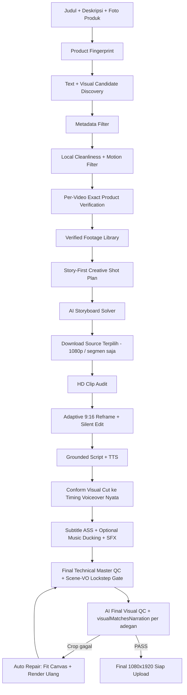

# 🎬 AI Affiliate Clipper

> 💻 **Project Status: Berjalan sepenuhnya lokal di perangkat Anda (PC Windows & HP Android/Termux)**  
> Repository GitHub: [https://github.com/Zozodoank/clippervps.git](https://github.com/Zozodoank/clippervps.git)  
> Semua proses pemrosesan (analisa stream, ekstraksi frame, FFmpeg render, Gatekeeper AI lokal) dieksekusi langsung di perangkat Anda — tanpa server cloud. Hanya panggilan API AI (Google Gemini / OpenRouter) yang lewat jaringan.

Web application berbasis **React (Vite)** dan **Node.js (Express)** yang bertugas mengotomatisasi pengubahan video YouTube menjadi **video reels vertikal 9:16 viral & high-converting** untuk promosi **Shopee Affiliate Marketing**. Seluruh pemrosesan berat (analisa stream, ekstraksi frame, FFmpeg rendering, dan AI vision) dijalankan langsung di perangkat Anda (tanpa server cloud).

---

## ⚡ Cara Menjalankan Secara Lokal

### 1. Dari Komputer / Laptop Windows (Lokal)
Jalankan dari terminal di folder proyek:
```bash
npm install
npm run dev
```
`dev-runner.js` otomatis menyalakan Backend (`:5000`), Frontend (`:3000`), dan Gatekeeper (`:5050`). Buka browser di `http://localhost:3000`.

### 2. Dari HP Android (Termux)
Panduan lengkap menjalankan langsung di HP Android (Termux) dapat dilihat di:  
👉 **[CARA_JALANKAN_TERMUX.md](file:///c:/Users/SEMOGA%20AWET/Documents/clipperVPS/CARA_JALANKAN_TERMUX.md)**


---

## 🌟 Professional Story-First Workflow


```mermaid
flowchart TD
    A[Judul + Deskripsi + Foto Produk] --> B[Product Fingerprint]
    B --> C[Text + Visual Candidate Discovery]
    C --> D[Metadata Filter]
    D --> E[Local Cleanliness + Motion Filter]
    E --> F[Per-Video Exact Product Verification]
    F --> G[Verified Footage Library]
    G --> H[Story-First Creative Shot Plan]
    H --> I[AI Storyboard Solver]
    I --> J[Download Source Terpilih - 1080p / segmen saja]
    J --> K[HD Clip Audit]
    K --> L[Adaptive 9:16 Reframe + Silent Edit]
    L --> M[Grounded Script + TTS]
    M --> N[Conform Visual Cut ke Timing Voiceover Nyata]
    N --> O[Subtitle ASS + Optional Music Ducking + SFX]
    O --> P[Final Technical Master QC + Scene-VO Lockstep Gate]
    P --> Q[AI Final Visual QC + visualMatchesNarration per adegan]
    Q -->|Crop gagal| R[Auto Repair: Fit Canvas + Render Ulang]
    R --> P
    Q -->|PASS| S[Final 1080x1920 Siap Upload]
```

### Prinsip kualitas utama

- **Exact product sebelum pooling:** frame yang bersih belum tentu produknya benar. Setiap kandidat harus lolos verifikasi jenis, mekanisme, konstruksi, dan brand/model bila memang diketahui.
- **Konsistensi lebih penting daripada banyak sumber:** satu video exact-product yang kaya adegan diprioritaskan. Sumber tambahan hanya dipakai jika benar-benar diperlukan dan sudah lolos verifikasi.
- **Story-first:** sistem membuat kebutuhan shot (hook, hero, mekanisme, aksi, hasil, CTA) lalu memilih footage yang memenuhi peran tersebut.
- **Pacing adaptif:** durasi scene tidak lagi dipaksa sama. Hook bisa pendek, demonstrasi bisa lebih panjang sesuai kebutuhan.
- **Voiceover mengontrol final timing:** setelah TTS selesai, visual dikonform ulang ke durasi suara aktual. Video tidak di-loop untuk menutupi voiceover yang terlalu panjang.
- **Final Master QC wajib:** job baru dianggap selesai setelah lolos pemeriksaan resolusi, durasi, audio, black/freeze frame, subtitle safe-zone, dan visual composition final.

### Face Policy & Scene↔VO Lockstep (khusus niche `gadget_smartphone`)

Dikelola **100% lewat data di `server/config/nichePresets.js`** — tidak ada `if (niche)` di service:

- **`facePolicy: 'presenter_only'` pada slot 5 (review kamera):** gatekeeper (port 5050) tetap memblokir wajah kreator yang memegang kamera (klasifikasi presenter vs wajah konten lewat ukuran face, kestabilan temporal IoU, dan fail-safe konservatif), tetapi hasil foto/video review dengan wajah reviewer di dalam frame TIDAK dibuang. Frame tersebut masuk pool terpisah `cameraResultEligibleFrames` yang **hanya** boleh dipakai slot ber-policy `presenter_only`. Niche lain (kitchen) selalu `strict` = perilaku lama, face detection lokal tetap per mandat Anda (diserahkan ke Gemini Filter 3).
- **`strictSceneVoSync: true` pada preset gadget:** ekspansi loop klip saat conform dilarang; jumlah adegan wajib sama persis dengan baris voiceover. Segment plan `[{slot, timeStart, voLine, visualClaim}]` dihitung setiap conform (`sceneVoSegments` di job), divalidasi `validateScriptSlotAlignment`, dan dijadikan bahan Final QC: gate deterministik `auditSceneVoLockstep` + pemeriksaan AI `visualMatchesNarration` per adegan (field `narrationMismatch`).
- Test regresi: `server/tests/facePolicy.test.js`, `storyboardFacePolicy.test.js`, `sceneVoLockstep.test.js`, `qcLockstep.test.js`, dan `server/gatekeeper/test_face_policy.py`.

### Konfigurasi finishing opsional

Tambahkan ke `server/.env` bila aset tersedia:

```bash
# Musik latar lokal. Kosong = tanpa musik.
BACKGROUND_MUSIC_PATH=/path/to/background_music.mp3
BACKGROUND_MUSIC_VOLUME=0.10

# SFX lokal opsional pada pergantian shot.
SFX_CLICK_PATH=/path/to/click.wav
SFX_WHOOSH_PATH=/path/to/whoosh.wav

# Final AI visual QC aktif secara default.
# false = hanya gunakan Technical Master QC.
FINAL_AI_QC=true

# Jika true, outage/error AI Final QC membuat job gagal.
# Default false: outage AI QC fallback ke Technical Master QC.
FINAL_AI_QC_STRICT=false
```

> Musik/SFX tidak wajib. Pipeline tetap menghasilkan final video dengan voiceover, subtitle, loudness normalization, dan Master QC tanpa aset tersebut.

---

## 🎯 5 Output Tab Kreatif Siap Pakai

1. **🎬 Kotak Scene**: Rincian per adegan (`timeRange`, deskripsi visual adegan, teks narasi spoken line, dan catatan sutradara *Ad Advisor* seperti SFX & text-on-screen).
2. **📋 Sample Context**: Rangkuman nama produk, target audiens, masalah utama yang diselesaikan (*pain points*), keunggulan utama (USPs), dan trigger psikologis pembelian.
3. **🎙️ Naskah Voiceover (ID)**: Format standar *Ad Advisor* (`[HOOK 0-3s]` → `[DEMO & BENEFIT 3-20s]` → `[VALUE PROPOSITION 20-35s]` → `[CALL TO ACTION 35-60s]`) berbasis judul & deskripsi produk spesifik.
4. **🤖 Prompt Google AI Studio**: Prompt terstruktur siap copy-paste langsung ke Google AI Studio untuk generate TTS audio.
5. **📱 Reels Caption & Shopee Link**: Caption siap posting lengkap dengan emoji, hashtag viral (#racunshopee, #spillracun, dll.), dan link Shopee Affiliate Anda.

---

## 🚀 Cara Menjalankan Aplikasi Secara Lokal / Termux

### Setup Termux pertama kali
```bash
cd ~/clipper
bash setup-termux.sh
nano server/.env
```

Isi minimal:
```bash
GEMINI_API_KEY=isi_api_key_gemini_anda
GEMINI_MODEL=gemini-3.6-flash
```

Jika `GEMINI_API_KEY` baru ditambahkan saat server sudah berjalan, klik **Check** di status engine atau restart server agar `.env` dibaca ulang. Backend juga akan reload `.env` otomatis saat request generate berikutnya.

### 1. Buka Terminal di Folder Proyek
```bash
cd "c:\Users\SEMOGA AWET\Documents\clipper"
# atau di Termux: cd ~/clipper
```

### 2. Jalankan Server & Client Bersamaan
```bash
npm run dev
```

> **Alamat Layanan:**
> - **Frontend (React/Vite)**: `http://localhost:3000`
> - **Backend (Express API)**: `http://localhost:5000`

---

## 📱 Panduan Penggunaan & Finalisasi

1. **Tahap 1 (Clipping & Scripting)**:
   - Pastikan `GEMINI_API_KEY` sudah terisi di file `server/.env` (Dapatkan gratis di [aistudio.google.com](https://aistudio.google.com)).
   - Masukkan **Judul / Nama Produk** (Contoh: *Mini Portable Blender USB 350ml Rechargeable*).
   - Masukkan **Deskripsi & Spesifikasi Produk** (Poin penting & keunggulan barang).
   - Masukkan **YouTube Video URL** dan **Shopee Affiliate Link**.
   - Klik **"Generate Kotak Scene & Video 9:16"**.
   - Pipeline menyaring kandidat, memverifikasi exact-product per video, lalu memilih source paling konsisten.
   - AI menyusun storyboard berdasarkan peran shot dan FFmpeg merender edit 9:16 dengan pacing adaptif.
   - Backend dapat membuat TTS otomatis; jika TTS berhasil, visual dikonform ulang ke timing suara sebelum final render.
2. **Tahap 2 (Upload Voiceover & Finalisasi)**:
   - Buka tab **Prompt Google AI Studio** atau **Naskah Voiceover** dan copy teksnya.
   - Generate audio TTS di [Google AI Studio](https://aistudio.google.com) lalu download file `.mp3`.
   - Drag & drop file `.mp3` ke kotak **Tahap 2: Upload Voiceover AI Studio**.
   - Klik **"Gabungkan Voiceover & Bakar Subtitle (Final Video)"**.
   - Backend menolak looping footage, melakukan loudness normalization, lalu menjalankan Technical + AI Final Master QC.
   - Jika AI menemukan crop terlalu agresif, sistem mencoba auto-repair `fit_canvas` dan QC ulang.
   - Video hanya ditandai **completed** setelah lolos QC.

---

## 💾 Cara Sistem Menghemat Kuota

Sistem **tidak** mengunduh video penuh untuk menganalisa kandidat. Penghematan terjadi berlapis:

1. **Metadata-only (0 unduh video):** judul, durasi, resolusi maksimal, dan URL stream diambil lewat yt-dlp `--dump-json` (±30–600 KB/kandidat). Kandidat beresolusi <720p atau durasi di luar 50s–15mnt langsung ditolak di sini.
2. **Frame sampling langsung dari stream HLS (tanpa unduh file):** ekstraksi ±200–500 frame (1 frame per 1,5 detik, cap 500) via FFmpeg *two-stage seek* (range-seek HTTP). Rata-rata ±1 MB, tapi bisa ~12–18 MB untuk video panjang yang di-sample penuh. Frame disaring **Gatekeeper lokal (port 5050) via localhost — 0 kuota internet.**
3. **Watermark Probe (opsional, default ON):** sebelum dense sampling, 5 titik frame dicek; bila ≥3/5 ber-watermark persisten, kandidat dibuang **sebelum** membayar sampling penuh. Matikan: `GK_WATERMARK_PROBE=0`.
4. **Unduh 1080p HANYA untuk source terpilih:** setelah AI menyetujui storyboard, barulah video sumber diunduh untuk render. Ini pos kuota terbesar (rata-rata ±81 MB/file terukur).

### Flag hemat kuota tahap render (`server/.env`) — semua default aman untuk PC
| Flag | Default | Fungsi |
|---|---|---|
| `RENDER_VIDEO_ONLY` | ON | Jangan unduh audio sumber (selalu dibuang `-an`, VO dibuat sendiri). Murni hemat, nol efek kualitas. Set `0` untuk tetap unduh audio. |
| `RENDER_MAX_HEIGHT` | `1080` | Cap tinggi video render (format terbaik yang diunduh). Default 1080 di SEMUA mesin, termasuk Termux (keputusan: hasil akhir dipaksa 1080p pada semua mode + retry). Sampling/verifikasi tetap 360p/480p murah. Turunkan ke `720` hanya bila bersedia render lebih lambat & panas di T7250. |
| `RENDER_DOWNLOAD_SECTIONS` | OFF | `1` = unduh HANYA segmen klip yang dipakai (`yt-dlp --download-sections`), potensi hemat 80–95%. Bila satu segmen gagal, otomatis fallback ke unduhan penuh. |
| `RENDER_SECTION_PAD` / `_TAIL_PAD` / `_GAP` | `2` / `5` / `15` | Tuning pengelompokan segmen (detik). Hanya aktif saat `RENDER_DOWNLOAD_SECTIONS=1`. |
| `DOWNLOAD_ARCHIVE_PATH` | OFF | Anti unduh ulang videoId yang sama lintas job. Aktifkan HANYA bila folder output render persisten. |

> **Render di Termux:** default SAMA dengan PC = `RENDER_MAX_HEIGHT=1080` (keputusan: kualitas akhir dipaksa 1080p di semua mode). Nilai ini ikut **dibekukan per-job** di `configSnapshot`, sehingga retry mereproduksi tinggi yang sama walau `.env` sudah berubah. Bila kelak ingin hemat kuota/CPU, set `RENDER_MAX_HEIGHT=720` manual di `server/.env` Termux. Untuk menjamin sumber memang >720p, gerbang metadata `checkVideoMetadataCompliance` menegakkannya otomatis — **syarat: `cookies.txt` tersedia** agar probe format terpercaya (tanpa cookies YouTube membatang daftar format ke 360p, sehingga penolakan keras dilewati).

> Estimasi nyata: **±150–270 MB per job selesai** di PC (didominasi unduhan render 1080p). Dengan **720p + download-sections** bisa turun ke kisaran **±35–90 MB/job**.

### Sampling frame bisa diperlonggar bila kuota sangat mepet
Jumlah frame analisa dihitung `durasi / 1.5s` (cap 500). Menurunkan rasio/cap memangkas kuota sampling **dan** CPU Gatekeeper, tapi mengurangi resolusi temporal (risiko blind-spot adegan singkat).

---

## 🛰️ VLM Oracle — vonis frame oleh model besar di Kaggle (opsional)

**Kenapa fitur ini ada.** SmolVLM2 yang dijalankan langsung di perangkat (llama.cpp `llama-mtmd-cli` di Termux/proot-distro) **terukur terlalu lambat untuk jadi gerbang per-scene**: pada Unisoc T7250 (7 core, 8 GB RAM) biaya muat model hanya ±2 detik tetapi **biaya per frame 36–52 detik** — bukan per proses (2 frame sekali panggil = 90 dtk, 4 frame = 162 dtk). Menurunkan resolusi (640/320 px) dan mengatur jumlah thread tidak menolong. Yang lebih fatal: pada 4 frame yang sudah ditolak SCRFD karena wajah, model menjawab **"SAFE" 4/4**. Artinya mengaktifkan VLM di HP justru **melonggarkan** filter. Karena itu `VISION_VERIFY_MODE` di Termux dibiarkan `legacy`.

**Desain Oracle.** Bobot besar (default **Qwen2.5-VL-7B-Instruct-AWQ**) dijalankan di **GPU Kaggle**, dan Kaggle **hanya** dipakai untuk analisa frame — seluruh sisanya (yt-dlp, Gatekeeper ONNX, Whisper, render) tetap di PC/Termux. Arah koneksi dipaksa oleh fakta bahwa notebook Kaggle tidak punya inbound: **notebook yang menjadi klien** (`claim` → unduh frame → vonis → `result`). Pipeline lokal tidak pernah menelepon Kaggle; ia menulis batch ke antrean SQLite `vlm_oracle_batches` dan menunggu vonis. Notebook boleh mati kapan saja.

**Kebijakan fallback (bukan fail-open).** Oracle menjawab → frame yang divonis KOTOR masuk `blacklistedFramePaths` yang sudah dipakai storyboard Gemini, sehingga otomatis dikecualikan. Oracle diam / timeout / vonis tidak sah / notebook mati → **tidak ada frame yang diveto**, dan keputusan Gatekeeper legacy + Gemini tetap berlaku penuh. Jalur legacy **tidak pernah** dilewati — berbeda dengan mode `smolvlm` yang me-`return` lebih awal dan karena itu melompati Whisper + Gatekeeper.

**Dua titik veto.** (1) **Pool pass** — sebelum storyboard, frame pool divisit dan yang kotor jadi `blacklistedFramePaths` (plafon `VLM_ORACLE_MAX_FRAMES`). (2) **Clip pass** di tahap `clip_audit` — sesudah klip final terbentuk dari file section hasil `--download-sections`, frame yang **sudah** diekstrak pada `sampleStepSec = 0.40` (2,5 fps) divisit **per klip**; klip yang kotor masuk `discardedDirtyClips` dengan reason `ORACLE_DIRTY` dan dipulihkan oleh mesin recovery yang sudah ada (Slot 1 restore + `pooledFrames`). Tidak ada ekstraksi FFmpeg tambahan, dan vonis hanya jatuh bila oracle benar-benar menjawab. Urutan dalam loop tidak berubah: gerbang motion (SSIM) tetap lebih dulu karena murah, oracle sesudahnya karena mahal. Yang memveto di sini adalah model besar di GPU — bukan ClipAudit lokal, yang memang dilarang menolak klip karena teks/wajah.

**Frame dikirim 360p, bukan 1080p.** Section tetap diunduh 1080p (`RENDER_DOWNLOAD_SECTIONS`/`RENDER_MAX_HEIGHT` tidak berubah — kualitas sumber jaga), tetapi JPEG yang diserahkan ke notebook di-kecilkan lebih dulu di perangkat (`scale=-2:<h> -q:v 4`, lebar otomatis genap sehingga rasio terjaga). Alasannya byte: terukur **298 KB → 32 KB** pada frame 1080p (±9x lebih kecil), dan visi model juga membayar lebih sedikit vision-token. Salinan hanya ditulis di `server/temp/oracle_frames/<jobId>_h<height>/` (dalam allowlist `isAllowedFramePath`, dibersihkan sapuan usia 6 jam), file asli tidak pernah disentuh, dan **vonis selalu dipetakan balik ke path asli** supaya `blacklistedFramePaths` tetap cocok. File ≤ 200 KB tidak dikecilkan (tidak layak), dan konversi gagal/timeout 20 s → pakai file asli; job tidak pernah dijatuhkan karena urusan ini.

| Flag (`server/.env`) | Default | Fungsi |
|---|---|---|
| `VISION_VERIFY_MODE` | `legacy` | Set `oracle` untuk mengaktifkan lapisan veto model besar. |
| `VLM_ORACLE_MAX_FRAMES` | `120` | Plafon **total** frame per job pada **pool pass** yang dikirim ke GPU (dipilih merata sepanjang garis waktu). `0` = tidak ada yang divisit. |
| `VLM_ORACLE_FRAME_HEIGHT` | `360` | Tinggi (px) JPEG yang **dikirim ke Kaggle**. Section tetap 1080p; frame dikecilkan lokal sebelum upload. Dijepit 240–720; `0` = kirim mentah (untuk kalibrasi). Naikkan ke `480`/`720` tanpa perubahan kode bila watermark/subtitle tipis tak terbaca. |
| `VLM_ORACLE_AUDIT_MAX_FRAMES` | `90` | Plafon frame untuk **clip pass** (`clip_audit`, dibagi rata antar klip, minimal 2 per klip). Dijepit 8–240; `0` = clip pass dimatikan, pool pass tetap jalan. |
| `VLM_ORACLE_BATCH_SIZE` | `8` | Frame per batch (dijepit 1–16). |
| `VLM_ORACLE_TIMEOUT_SEC` | `180` | Tunggu maksimal per batch. Lewat → lanjut, tidak memveto. |
| `VLM_ORACLE_TOTAL_TIMEOUT_SEC` | `600` | Anggaran waktu seluruh tahap oracle dalam satu job. |
| `VLM_ORACLE_POLL_MS` | `2000` | Interval worker memeriksa vonis. |
| `VLM_ORACLE_STALE_SEC` / `_MAX_ATTEMPTS` | `300` / `2` | Batch `claimed` yang lebih tua dari ini dianggap notebook mati dan dikembalikan ke `pending`; setelah `MAX_ATTEMPTS` ditandai `expired` agar GPU tidak dibuang untuk kerjaan yatim. |

### Runbook sisi lokal
1. **Wajib:** isi `API_ACCESS_TOKEN` di `server/.env` (perangkat yang menjalankan server — saat ini Termux), restart server. Endpoint oracle sengaja menjawab **503** selama token kosong, karena pihak yang mengambil data adalah mesin di luar jaringan Anda dan yang diserahkan adalah bingkai video Anda. Token juga satu-satunya gerbang `/api/vlm-oracle/*`; tidak ada sistem secret terpisah.
2. Pastikan tunnel publik aktif (`cloudflared tunnel --url http://localhost:5000`) dan catat URL-nya — quick tunnel **ganti URL setiap restart**, jadi nilai ini harus dikirim ulang ke Kaggle tiap kali (lewat `deploy.ps1`, tanpa membuka UI; lihat Runbook Kaggle).
3. Cek antrean: `GET /api/vlm-oracle/status` (butuh token header `x-api-token`). Endpoint `/vlm-oracle/*` **tidak boleh** dimasukkan ke allowlist publik `tokenAuth` (sudah ada test yang mengunci hal ini).
4. Set `VISION_VERIFY_MODE=oracle` lalu jalankan job seperti biasa. Log menampilkan `[Oracle] ⛔ N/M frame diveto model besar...` untuk pool pass dan `🛰️ Oracle Kaggle memvonis klip final` + reason `ORACLE_DIRTY` untuk clip pass.

### Runbook sisi Kaggle (CLI — jalur termudah, tanpa UI)

Kenapa CLI dan bukan copy-paste di UI atau "attach GitHub + Run manual": `kaggle kernels push` membuat Kaggle **langsung menjalankan versi baru**, bisa diulang tiap `kaggle/vlm_oracle_qwen.py` berubah, dan log eksekusi bisa ditarik ke PC. Attach GitHub tidak auto-run per commit dan tidak bisa mengirim argumen.

Satu hal yang harus diakali: **metadata kernel Kaggle tidak bisa memuat env var**, padahal URL quick-tunnel berganti tiap server restart — kalau harus lewat UI, oracle mati tiap hari. Karena itu URL + token dikirim sebagai **dataset privat kecil** (`<user>/clippervps-oracle-config` berisi `oracle_config.json`) yang di-attach ke kernel. Urutan baca worker: **env var Kaggle > `oracle_config.json` > default**, jadi menimpa cepat dari UI tetap mungkin.

```powershell
# 0. Sekali saja: pasang CLI (butuh Python).
python -m pip install --user --upgrade kaggle

# 1. Cek kredensial + staging tanpa mengirim apa pun (tidak ada sesi GPU baru).
#    Kredensial dibaca dari KAGGLE_API_TOKEN di server/.env, fallback kaggle.json.
powershell -ExecutionPolicy Bypass -File kaggle\deploy.ps1 -NoPush

# 2. Hari-H: upload URL tunnel (+ token) lalu push kernel. Tambahkan -Logs untuk
#    menarik log sesi ke scratch/kaggle_out/.
powershell -ExecutionPolicy Bypass -File kaggle\deploy.ps1 -TunnelUrl https://abc-123.trycloudflare.com -WithToken -Logs

# 2b. Versi paling aman: ambil URL tunnel + token LANGSUNG dari .env Termux lewat
#     SSH (parameters sync.config.json), sehingga rahasia tidak pernah Anda salin,
#     tidak dicetak ke terminal, dan tidak masuk git.
powershell -ExecutionPolicy Bypass -File kaggle\deploy.ps1 -FromTermux -Logs

# 3. Tarik log sesi terakhir saja.
powershell -ExecutionPolicy Bypass -File kaggle\deploy.ps1 -Logs -NoPush
```

1. `kaggle/kernel-metadata.example.json` adalah template (`enable_gpu`, `machine_shape: NvidiaTeslaT4`, `enable_internet: true` — wajib untuk pip install + unduh bobot). `deploy.ps1` menyalinnya ke `kaggle/.deploy/kernel-metadata.json` dengan **id asli** + `dataset_sources` hasil langkah 2; folder `.deploy*` sudah di-gitignore karena memuat username, URL tunnel, dan token.
2. **Validasi dulu tanpa membakar kuota GPU:** set `ORACLE_NO_MODEL=1` (env var Kaggle) dan jalankan. Kalau log menampilkan `claim ...` dan vonis `dry-run` diterima server, tunnel + token sudah benar. Matikan flag itu untuk menjalankan model sungguhan (`Qwen2.5-VL-7B-Instruct-AWQ` via Hugging Face; bila jaringan Kaggle menolak HF, `pip install kagglehub` + `kagglehub.model_download(...)` lalu set `ORACLE_MODEL_ID` ke path lokal).
3. Notebook looping dan berhenti sendiri setelah `ORACLE_MAX_MINUTES` (default 690 menit) agar tidak dipotong paksa di jam ke-12. Kuota GPU Kaggle ±30 jam/minggu — jangan biarkan looping kosong menyala semalaman; hentikan manual bila tidak ada job, dan jalankan `deploy.ps1` lagi untuk memulai sesi hari berikutnya.
4. Jangan hard-code token di notebook — log notebook bisa ter-share.

### Kalibrasi: apakah 360p "cukup mumpuni" (diukur, bukan dikira-kira)

`scratch/oracle_calibrate.mjs` menjawab ini dengan data yang sudah ada di perangkat: label **KOTOR** = `server/rejected_frames/yunet/*.jpg` (ditolak SCRFD/DBNet lokal), label **BERSIH** = frame yang lolos gatekeeper lokal di `server/temp`. Skrip mengirim kedua kelompok pada **beberapa tinggi sekaligus** (`--heights=0,360,720`; `0` = mentah sebagai kontrol) lalu mencetak recall + false-reject per tinggi. Ambang lanjut: **recall ≥ 90%** dan **false-reject ≤ 10%**. Skrip bicara langsung ke antrean `jobStore` (bukan HTTP), jadi tidak butuh token; `--simulate=clean|dirty` memakai DB terpisah di temp dan hanya melayani batch miliknya sendiri — tidak pernah merebut batch job produksi.

```powershell
node scratch\oracle_calibrate.mjs --simulate=dirty --heights=360   # uji plumbing, tanpa GPU
node scratch\oracle_calibrate.mjs --heights=0,360,720 --dirty=16 --clean=16 --batch=4   # notebook harus sedang claim
```

Hasil kalibrasi sungguhan (butuh notebook aktif) — isi tanggal + angka saat dijalankan:

| Tanggal | `VLM_ORACLE_FRAME_HEIGHT` | recall | false-reject | Keputusan |
|---|---|---|---|---|
| _(belum dijalankan — kolom ini diisi setelah kalibrasi nyata)_ | `360` | — | — | — |

Bila 360p tidak mencapai ambang (watermark/subtitle kecil hilang), naikkan `VLM_ORACLE_FRAME_HEIGHT=480|720` di `server/.env` — itu flag, tidak perlu perubahan kode — lalu catat hasilnya di tabel ini.

> **`kaggle.json`** (kredensial API Kaggle: username + key) **tidak boleh di-commit** — sudah masuk `.gitignore`. Kalau file itu pernah ada di folder repo yang ter-share, revoke key-nya di Kaggle > Account > Create New API Token.
